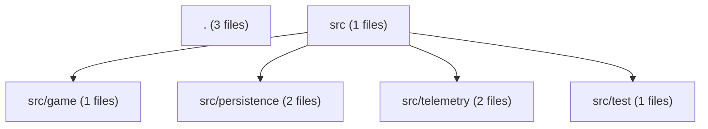
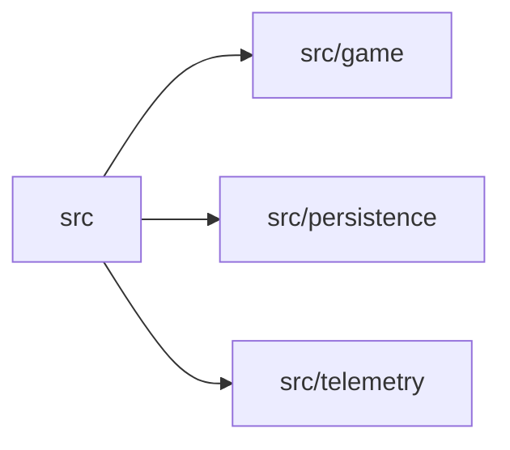
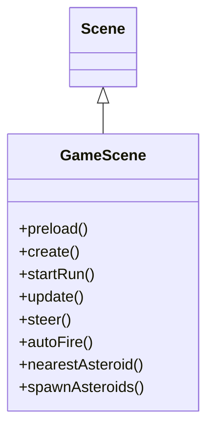

# Architecture — Asteroids Survivor

> Generated by an auto-documentation run from the project's own structure: module layout, imports between modules, and HTTP route signatures. Function bodies were not read, so nothing here describes internal behaviour.

**10** source files · **0** Python · **10** TypeScript · **5** internal imports · **0** HTTP routes

## Overview

Asteroids Survivor is a TypeScript project organized under a `src/` directory with four primary subdirectories: `game/`, `persistence/`, `telemetry/`, and `test/`. The root and `src/` directories each contain a small number of additional files, bringing the total to ten source files.

The `persistence/` layer exposes a single module, `storage.ts`, which implements local persistence using IndexedDB. Its docstring notes that nothing leaves the device unless explicitly sent elsewhere. The `telemetry/` layer provides a beacon client in `beacon.ts` for sending telemetry data. The `game/` directory contains one module, and `test/` contains one test file.

There are five internal imports across the codebase, indicating modest coupling between these layers. No HTTP routes are defined in the project, so there is no network-facing API surface. The architecture consists of a game core, a local persistence layer, a telemetry client, and a test harness, with data flow implied by the import graph but not detailed in the available structural facts.

## Module map

## Package dependencies

## Object diagram

## Links

- [[Project]]
