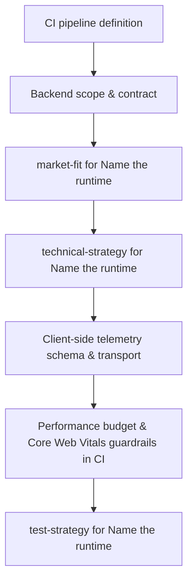
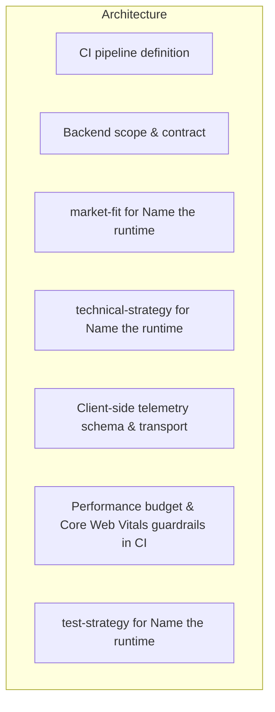
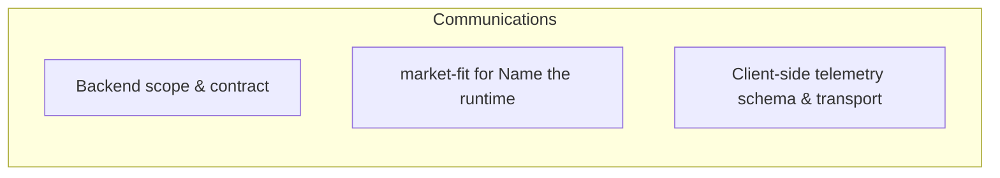
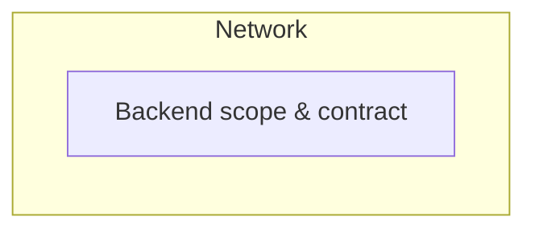
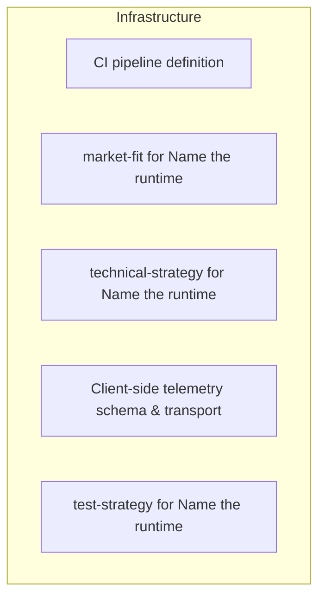

# Findings — Name the runtime

**Date:** 2026-09-11
**Kind:** Interview
**Attendees:**
- Product Manager
- Sales Manager
- Technical Engineering Manager
- Data Analyst
- QA Engineer

## Settled decisions

- **CI pipeline definition**: Cheap budget: Single job: `npm ci && npm run build && npx gh-pages -d dist`; no lint/typecheck/test gates, deploy on every `main` push.
- **Backend scope & contract**: Expert recommendation: Zero backend for MVP — all state local (IndexedDB), analytics via client-side beacon to Plausible/Umami; leaderboard deferred to post-MVP.
- **market-fit for Name the runtime**: Expert recommendation: Expose one documented endpoint plus a CSV export for Name the runtime; that covers the integrations customers ask for first.
- **technical-strategy for Name the runtime**: Expert recommendation: Sequence Name the runtime by risk: build the piece that can invalidate the design first, keep the rest behind flags.
- **Client-side telemetry schema & transport**: Expert recommendation: Define a tiny JSON event schema (session_id, event_name, timestamp, properties) sent via `navigator.sendBeacon()` to a managed analytics endpoint (e.g., Plausible, Umami, or a Cloudflare Worker) — zero backend code, works on static hosting.
- **Performance budget & Core Web Vitals guardrails in CI**: Expert recommendation: Add a GitHub Actions step running Lighthouse CI (headless Chrome) with budgets: LCP ≤ 2.5 s, CLS ≤ 0.1, INP ≤ 200 ms, total JS ≤ 170 kB gzipped; fail PR on any regression.
- **test-strategy for Name the runtime**: Expert recommendation: Cover the risky seams of Name the runtime with integration tests; unit-test only the logic that really branches.

## Remaining risks / open questions

_None — frontier is empty._

## What this means for the project

Technical interview on Name the runtime is complete. Decisions are in the settled tree. Confirm shared technical understanding before anyone implements.

## Specialty addenda

### Sales Manager

Locked. TypeScript on Node 20 for build, Phaser 3 in the browser, hosted on GitHub Pages. The two former guesses — CI pipeline and backend scope — now have expert recommendations in the settled tree. No open runtime questions remain.

### Technical Engineering Manager

**Locked — no guesses remain.**

- **Language/build runtime:** TypeScript on Node 20
- **Browser runtime:** Phaser 3 (ES modules)
- **Hosting:** GitHub Pages (static)

The two former open items now have expert recommendations in the settled tree:
- CI pipeline → Lighthouse CI budgets + lint/typecheck/test gates in GitHub Actions
- Backend scope → zero backend for MVP; IndexedDB local state, client-side beacon analytics, leaderboard deferred

Interview complete.

### Data Analyst

**Locked — no guesses remain.**

- **Language/build runtime:** TypeScript on Node 20
- **Browser runtime:** Phaser 3 (ES modules)
- **Hosting:** GitHub Pages (static)

The two former open items now have expert recommendations in the settled tree:
- CI pipeline → Lighthouse CI budgets + lint/typecheck/test gates in GitHub Actions
- Backend scope → zero backend for MVP; IndexedDB local state, client-side beacon analytics, leaderboard deferred

Interview complete.

### QA Engineer

**Confirmed — shared technical understanding is locked.**

**Settled (no guesses remain):**
- **Language/build runtime:** TypeScript on Node 20
- **Browser runtime:** Phaser 3 (ES modules)
- **Hosting:** GitHub Pages (static)
- **CI pipeline:** GitHub Actions with Lighthouse CI budgets (LCP ≤ 2.5s, CLS ≤ 0.1, INP ≤ 200ms, JS ≤ 170kB gzipped) + lint/typecheck/test gates
- **Backend scope:** Zero backend for MVP — IndexedDB local state, client-side `navigator.sendBeacon()` analytics to managed endpoint (Plausible/Umami/CF Worker), leaderboard deferred
- **Telemetry schema:** `{ session_id, event_name, timestamp, properties }` JSON via beacon
- **Test strategy:** Integration tests on risky seams; unit tests only on branching logic

**Open risks:** None on this frontier. All seats confirmed locked.

Ready for implementation.

## Flowchart

## Architecture

## Communications

## Network

## Infrastructure

## Sources

- [[ci-pipeline-definition]]
- [[backend-scope-contract]]
- [[market-fit-name-runtime]]
- [[technical-strategy-name]]
- [[client-side-telemetry-schema]]
- [[performance-budget-core-web]]
- [[test-strategy-name-runtime]]

## Links

- [[Project]]
- meeting `b67ab027`
