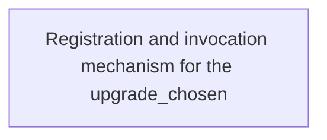
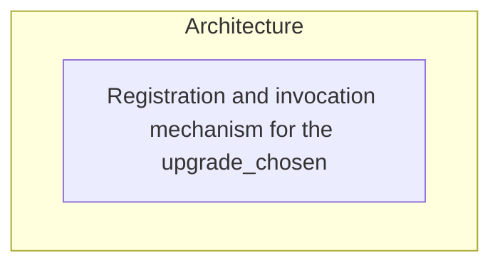

# Findings — Define: (noun phrase <=8

**Date:** 2026-09-15
**Kind:** Interview
**Attendees:**
- Architect

## Settled decisions

- **Registration and invocation mechanism for the upgrade_chosen hook**: Expert recommendation: Use a typed event emitter (e.g., `mitt` or a minimal custom `EventTarget`) exported from a dedicated `upgradeHook.ts` module; the core loop calls `emitter.emit('upgrade_chosen', upgradeId)` and the UX validator subscribes via `emitter.on('upgrade_chosen', handler)`.

## Remaining risks / open questions

_None — frontier is empty._

## What this means for the project

# Topic Recap
Define the registration and invocation mechanism for the **upgrade_chosen** hook.

## Settled Technical Decisions
- **Registration and invocation mechanism for the upgrade_chosen hook**
  - **Expert recommendation**: Use a typed event emitter (e.g., `mitt` or a minimal custom `EventTarget`) exported from a dedicated `upgradeHook.ts` module; the core loop calls `emitter.emit('upgrade_chosen', upgradeId)` and the UX validator subscribes via `emitter.on('upgrade_chosen', handler)`.  
    - Source: [[adr-001-registration-invocation]]
  - **Cheap/budget**: Inline anonymous function assigned to a global `window.onUpgradeChosen` variable; core loop calls it directly; UX validator overwrites it.
  - **Expensive/premium**: Use a formal dependency injection container (e.g., `tsyringe`) to register a singleton `UpgradeChosenService` with `emit` and `on` methods, providing typed interfaces and lifecycle management.

## Remaining Technical Risks
_None — frontier is empty._

## What This Means for Implementation
- Create `src/hooks/upgradeHook.ts` exporting a singleton `mitt` emitter typed as `<{ upgrade_chosen: string }>`.
- In `src/game/GameScene.ts`, after an upgrade is chosen, import the emitter and invoke `emitter.emit('upgrade_chosen', upgradeId)`.
- In the UX validation module (e.g., `src/ux/upgradeValidator.ts`), subscribe on initialization: `emitter.on('upgrade_chosen', validateUpgradeChoice)`.
- Ensure the emitter is a true singleton (module‑level export) to avoid duplicate instances.
- Add unit tests that verify subscription, emission, and payload correctness.
- No further work is required on this item; the team can now proceed with CI setup, beacon mapping, and the wave‑1 core loop.

## Flowchart

## Architecture

## Sources

- _No definition notes._

## Links

- [[Project]]
- meeting `680e29d1`
