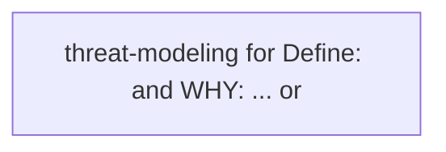
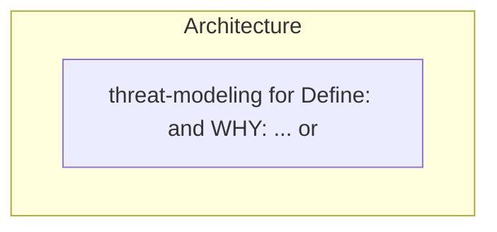
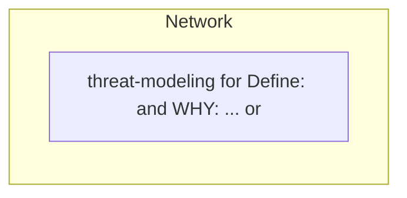

# Findings — Define: and WHY: ... or

**Date:** 2026-09-17
**Kind:** Interview
**Attendees:**
- Security Engineer

## Settled decisions

- **threat-modeling for Define: and WHY: ... or**: Expert recommendation: Authenticate Define: and WHY: ... or at the boundary, authorize per resource, and rate-limit whatever an attacker can reach.

## Remaining risks / open questions

_None — frontier is empty._

## What this means for the project

Technical interview on Define: and WHY: ... or is complete. Decisions are in the settled tree. Confirm shared technical understanding before anyone implements.

## Flowchart

## Architecture

## Network

## Sources

- _No definition notes._

## Links

- [[Project]]
- meeting `bb2dddd1`
