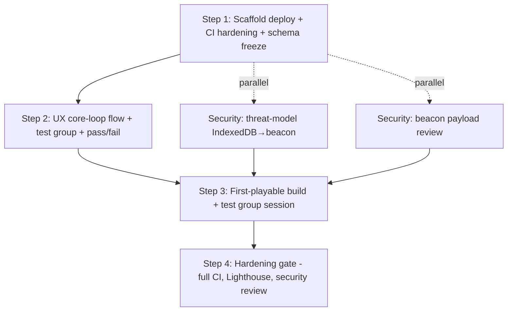

# Asteroids Survivor

**Kind:** Diagrams
**Date:** 2026-09-17
**Status:** completed
**Project:** [[Project]]

## Attendees

- Technical Engineering Manager
- Product Manager
- Data Analyst
- Sales Manager
- QA Engineer

## Transcript

## System

Diagram atlas opened from the Documentation map. Review the presented kind; lock decisions back on Docs or here.

## You

Presenting the Flowchart to the room for review.

## Product Manager

Product Manager has nothing to add on the atlas this pass.

## System

Product Manager picked Review back up - the last pass stopped short of finishing it.

## Product Manager

Product Manager has nothing to add on the atlas this pass.

## System

Product Manager picked Review back up - the last pass stopped short of finishing it.

## Product Manager

Product Manager has nothing to add on the atlas this pass.

---

Back to [[Project]]
