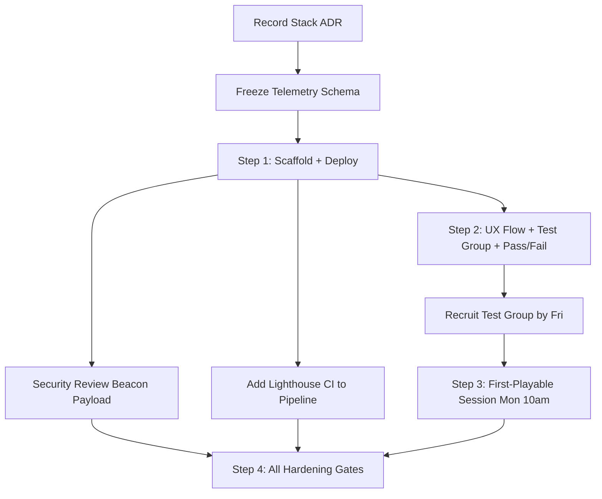

# Plan — Plan the first increment — ordered

**Date:** 2026-09-11  
**Kind:** Full directive  
**Status:** Planned  
**Audience:** coding agent — execute this spec, do not re-litigate  
**Project:** [[Project]]  
**Meeting:** `dcd07828`  

## Attendees & Ownership

- Product Manager
- Sales Manager
- Technical Engineering Manager
- Data Analyst
- QA Engineer
- Lead Engineer
- Security Engineer
- UX/UI Designer

## Goal
Ship a 12-day first increment that proves the core Survivors loop retains: scaffold deploys tomorrow (Step 1), UX defines the one-page core loop flow + named test group + pass/fail criteria tomorrow 9am (Step 2), first-playable session with 3 recruited players Monday 10am validates survive-90s-and-continue (Step 3), all hardening gates (CI, security, schema, performance) gate Step 4. Scope is core loop + IndexedDB persistence + GitHub Pages deploy only; everything else is a seat todo.

## Locked decisions
- Scope locked to core loop + local persistence (IndexedDB) + deploy to Pages — Product Manager
- Step 1 starts 2026-09-12 — Technical Engineering Manager / Lead Engineer
- Retention targets: Day-1 ≥ 35%, Day-7 ≥ 12% (industry baseline for Survivors loop) — Data Analyst
- Telemetry schema freezes 2026-09-11 (today) — Data Analyst / Security Engineer
- CI for Step 1 includes CSP header + `npm audit`; lint + typecheck already present — Security Engineer / QA Engineer
- Security review of beacon payload is a parallel gate before Step 3 (not post-increment) — Security Engineer
- Stack ADR must be recorded before scaffold starts — Lead Engineer / Technical Engineering Manager
- Test group: 3 named weekly browser arcade players (streamer, speedrunner, casual), recruited by 2026-09-11 2026-09-18, session Monday 2026-09-21 10:00 — UX/UI Designer
- Pass/fail criteria: survive 90s on first life AND hit "continue" after death without asking what to do — UX/UI Designer
- UX delivers one-page core loop flow + test group definition + pass/fail criteria by 2026-09-12 09:00 — UX/UI Designer
- Step 3 = first-playable test session Monday 2026-09-21 10:00 — Product Manager / Sales Manager
- Step 4 = all hardening gates (Lighthouse CI, full security review, complete CI gates) — Lead Engineer

## Constraints
- Must: Telemetry schema frozen before Step 1 ships (beacon in Step 1 must answer retention question)
- Must: CSP header + `npm audit` in Step 1 CI job
- Must: Stack ADR recorded before scaffold starts 2026-09-12
- Must: Security review of beacon payload completes before Step 3 session
- Must: Test group recruited by 2026-09-11 2026-09-18
- Must: Lighthouse CI budgets (LCP ≤ 2.5s, CLS ≤ 0.1, INP ≤ 200ms, total JS ≤ 170kB gzipped) gate Step 4
- Must-not: Add backend, leaderboard, auth, or any feature beyond core loop + IndexedDB + deploy
- Out of scope: Multiplayer, progression meta, settings, accessibility polish, marketing site — all seat todos
- Dissent: Data Analyst and QA Engineer insisted schema freeze and retention targets are preconditions for Step 1; Lead Engineer and Product Manager sequenced them as parallel tracks gating Step 4. This plan follows the Lead Engineer sequence but marks schema freeze as a hard constraint for Step 1 beacon.

## Surfaces
- **Deploy target**: GitHub Pages (`npx gh-pages -d dist`)
- **CI pipeline**: Single GitHub Actions job — `npm ci && npm run build && npx gh-pages -d dist` + CSP header + `npm audit` + lint + typecheck
- **Local persistence**: IndexedDB (client-side only)
- **Telemetry transport**: `navigator.sendBeacon()` to managed analytics endpoint (Plausible / Umami / Cloudflare Worker)
- **Telemetry schema**: JSON events — `session_id`, `event_name`, `timestamp`, `properties` (to be frozen today)
- **Performance budgets (Step 4 gate)**: LCP ≤ 2.5s, CLS ≤ 0.1, INP ≤ 200ms, total JS ≤ 170kB gzipped (Lighthouse CI)
- **Stack ADR**: Location not named — record before 2026-09-12 scaffold
- **UX flow doc**: One-page core loop flow + test group + pass/fail criteria — due 2026-09-12 09:00

## Execution graph

## Steps
1. `architecture/adr` — Record stack choice ADR (framework, build tool, deploy target) so scaffold doesn't churn — Acceptance: ADR file committed and linked in Architecture map
2. `telemetry/schema` — Freeze telemetry schema today (session_id, event_name, timestamp, properties + any retention-critical fields) — Acceptance: Schema JSON committed; beacon payload in Step 1 matches exactly
3. `ci/pipeline` — Add CSP header middleware and `npm audit` step to GitHub Actions job; verify lint + typecheck already run — Acceptance: CI run on `main` passes with CSP header present in deployed headers and `npm audit` exits 0
4. `scaffold` — Initialize repo with chosen stack, minimal entry point, IndexedDB wrapper stub, beacon sender stub, build script outputting to `dist/`, deploy script to Pages — Acceptance: `npm run build && npx gh-pages -d dist` succeeds; live URL loads blank shell with console log "scaffold ok"
5. `ux/flow-doc` — Deliver one-page core loop flow doc (first-run actions, persistence contract, return experience) + test group definition (3 named personas) + pass/fail criteria (survive 90s first life + hit continue without help) — Acceptance: Doc committed by 2026-09-12 09:00; Product Manager signs off
6. `recruiting/test-group` — Recruit 3 weekly browser arcade players (streamer, speedrunner, casual) by 2026-09-11 2026-09-18; confirm Monday 2026-09-21 10:00 session — Acceptance: 3 confirmed participants with contact + calendar invite sent
7. `core-loop/first-playable` — Implement playable core loop per UX flow: spawn, move, shoot, enemies, death, persist run to IndexedDB, "continue" button loads last run, beacon fires session_start/run_end/death/continue — Acceptance: Local build runs; IndexedDB persists across reload; beacon fires all 4 events with frozen schema
8. `security/beacon-review` — Threat-model IndexedDB→beacon flow; review beacon payload for PII/leakage; sign off — Acceptance: Security Engineer writes "beacon payload approved for Step 3" in PR
9. `ci/hardening` — Add Lighthouse CI step with budgets (LCP ≤ 2.5s, CLS ≤ 0.1, INP ≤ 200ms, JS ≤ 170kB gz) to pipeline; fail PR on regression — Acceptance: Lighthouse CI runs on PR and fails if any budget exceeded
10. `test-session/step3` — Run Monday 2026-09-21 10:00 session with 3 test players; observe pass/fail — Acceptance: All 3 survive 90s first life AND hit continue unassisted; session notes committed
11. `increment/step4-gate` — Merge all hardening: full CI green (lint, typecheck, unit test, Lighthouse, npm audit, CSP), security sign-off, schema frozen, retention beacon live — Acceptance: All checks pass on `main`; Product Manager tags `v0.1.0-increment1`

## Verification
- Live URL on GitHub Pages loads first-playable core loop
- IndexedDB persists run state across close/reopen
- Beacon events (session_start, run_end, death, continue) fire with frozen schema to analytics endpoint
- All 3 test players pass survive-90s-and-continue criteria
- CI pipeline on `main` passes: lint, typecheck, unit test, npm audit, CSP header, Lighthouse budgets
- Security Engineer signed off beacon payload
- Stack ADR recorded and linked
- Retention targets (Day-1 ≥ 35%, Day-7 ≥ 12%) documented for post-increment measurement

## Open risks
- Schema freeze today (2026-09-11) — if not done, Step 1 beacon ships blind; Data Analyst and Security Engineer must deliver before scaffold
- Stack ADR not yet recorded — Lead Engineer must confirm before 2026-09-12 morning
- Test group recruitment by 2026-09-11 2026-09-18 — UX/UI Designer owns; no backup plan named
- Security review of beacon payload before Monday 2026-09-21 — Security Engineer must complete in parallel
- Lighthouse CI budgets may fail on first run — budget values are expert recommendations, not yet validated against actual build
- Analytics endpoint (Plausible/Umami/Cloudflare Worker) not selected — beacon sender stub points nowhere until chosen

---

## Links

- [[Project]]
- Source meeting: `dcd07828`
