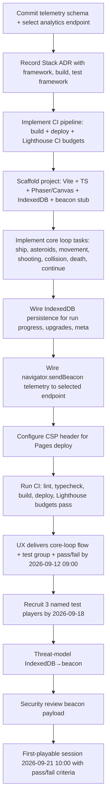

# Plan — Unblock and execute the locked 12-day first increment for Asteroids Survivor. Three hard prerequisites (telemetry schema

**Date:** 2026-09-11  
**Kind:** Refine  
**Status:** Planned  
**Audience:** coding agent — execute this spec, do not re-litigate  
**Project:** [[Project]]  
**Meeting:** `f9bddde9`  

## Attendees & Ownership

- Product Manager
- Technical Engineering Manager
- Lead Engineer
- Security Engineer
- QA Engineer

Unblock and execute the locked 12-day first increment for Asteroids Survivor. Three hard prerequisites (telemetry schema freeze, Stack ADR, CI pipeline with Lighthouse budgets) must land today (2026-09-11) before scaffold starts tomorrow (2026-09-12). Then: scaffold deploys to GitHub Pages with CSP + `npm audit`, UX delivers core-loop flow by 09:00, three named test players recruited by 2026-09-18, threat-model + beacon review complete before first-playable session 2026-09-21 10:00. Scope: core loop + IndexedDB persistence + Pages deploy only.

## Already settled
- Scope locked to core loop + local persistence (IndexedDB) + deploy to Pages; everything else is a seat todo — Product Manager
- Retention targets: Day-1 ≥ 35%, Day-7 ≥ 12% — Data Analyst
- Telemetry schema freezes today (2026-09-11) — Data Analyst, Security Engineer, QA Engineer
- Stack ADR must be recorded before scaffold starts tomorrow — Lead Engineer, Technical Engineering Manager
- CI for Step 1 includes CSP header + `npm audit`; lint + typecheck already present; full gates (Lighthouse CI, etc.) gate Step 4 — Security Engineer, QA Engineer, Lead Engineer
- Security review of beacon payload moves to parallel gate before Step 3 — Security Engineer
- Threat-model IndexedDB→beacon before Step 3 — Security Engineer
- UX delivers one-page core loop flow + test group definition + pass/fail criteria by 2026-09-12 09:00 — UX/UI Designer
- Test group: 3 named players (streamer, speedrunner, casual), recruited by 2026-09-18, session 2026-09-21 10:00 — UX/UI Designer
- Pass/fail criteria: survive 90s on first life AND hit "continue" after death without asking what to do — UX/UI Designer
- Deploy to GitHub Pages via `npx gh-pages -d dist` on zero-cost infra
- Must-not: Add backend, leaderboard, multiplayer, or any feature outside core loop + local save + deploy

## Still open
- Telemetry schema file not committed; analytics endpoint (Plausible/Umami/Cloudflare Worker) not selected — deadline today
- Stack ADR not recorded; unit test framework (Vitest/Jest) undecided — must land before 2026-09-12
- CI pipeline (GitHub Actions) not implemented; Lighthouse CI budgets (LCP ≤ 2.5s, CLS ≤ 0.1, INP ≤ 200ms, total JS ≤ 170kB gzipped) not configured — must land before 2026-09-12
- First-playable scope (ship, asteroids, movement, shooting, collision, death, continue) not broken into implementable tasks
- Test player recruitment owner not named (UX/UI Designer or Product Manager)
- Threat model and beacon review — Security Engineer, no committed completion date before 2026-09-21

## Execution graph

## Instructions
1. `docs/telemetry-schema.json` — create the frozen JSON event schema with fields `session_id` (string, UUID), `event_name` (string, enum: `session_start`, `session_end`, `death`, `continue`, `upgrade_pick`, `level_up`), `timestamp` (ISO 8601), `properties` (object, extensible) — Acceptance: file exists, valid JSON, enum matches locked events, committed to `main` before 2026-09-11 23:59
2. `docs/telemetry-schema.json` — add `analytics_endpoint` field documenting selected provider (Plausible/Umami/Cloudflare Worker) and endpoint URL — Acceptance: endpoint chosen, URL present, no placeholder
3. `docs/adr/0001-stack.md` — record Stack ADR: framework (Vite), language (TypeScript), renderer (Phaser 3 or Canvas API — pick one), state management (none, plain TS), test framework (Vitest or Jest — pick one), deploy target (GitHub Pages via `gh-pages`) — Acceptance: ADR committed, status "Accepted", all choices explicit, no "TBD"
4. `.github/workflows/ci.yml` — implement single-job pipeline: `npm ci` → `npm run lint` → `npm run typecheck` → `npm run build` → `npx gh-pages -d dist` → Lighthouse CI step with budgets (LCP ≤ 2.5s, CLS ≤ 0.1, INP ≤ 200ms, total JS ≤ 170kB gzipped) — Acceptance: workflow runs on `push` to `main`, fails on any budget regression, `npm audit` runs and fails on high/critical
5. `vite.config.ts` — configure build output to `dist/`, enable CSP meta tag injection for Pages (script-src 'self'; style-src 'self' 'unsafe-inline'; img-src 'self' data:; connect-src 'self' <analytics_endpoint>) — Acceptance: `npm run build` produces `dist/index.html` with CSP meta tag, `connect-src` matches selected analytics endpoint
6. `src/main.ts` — scaffold entry point: init Phaser/Canvas, bootstrap game scene, register `beforeunload` handler to flush IndexedDB → beacon via `navigator.sendBeacon()` — Acceptance: dev server starts (`npm run dev`), no console errors, beacon stub fires on unload
7. `src/scenes/BootScene.ts` — implement BootScene: load assets, initialize IndexedDB (idb wrapper), restore last run state or create fresh — Acceptance: IndexedDB opens, reads/writes `runState` key, survives reload
8. `src/scenes/GameScene.ts` — implement core loop tasks as separate methods: `spawnShip()`, `spawnAsteroids()`, `handleMovement()`, `handleShooting()`, `handleCollision()`, `handleDeath()`, `showContinuePrompt()` — Acceptance: each method exists, unit-testable (pure logic extracted), ship moves, asteroids spawn, shooting works, collision detects, death triggers, continue prompt appears
9. `src/systems/persistence.ts` — implement IndexedDB wrapper: `saveRun(state)`, `loadRun()`, `saveMeta(meta)`, `loadMeta()` — Acceptance: Vitest/Jest tests pass for save/load round-trip, schema versioned, migration stub present
10. `src/systems/telemetry.ts` — implement `sendEvent(name, properties)` using `navigator.sendBeacon()` to selected endpoint with frozen schema — Acceptance: beacon fires in devtools Network tab, payload matches `docs/telemetry-schema.json`, no CORS errors
11. `src/scenes/GameScene.ts` — integrate telemetry calls at: session_start, death, continue, upgrade_pick, level_up, session_end — Acceptance: events appear in analytics endpoint test dashboard (or local mock), schema validates
12. `package.json` — add `test` script (Vitest/Jest), `test:ci` (headless), ensure `npm run test:ci` runs in CI — Acceptance: `npm run test:ci` exits 0, coverage > 0% on persistence + telemetry modules
13. `README.md` — document local dev (`npm run dev`), build (`npm run build`), deploy (`npm run deploy`), test (`npm run test:ci`), telemetry schema location — Acceptance: fresh clone → `npm ci` → `npm run dev` works, `npm run build` → `npm run deploy` publishes to Pages

## Verification
- All 13 instructions complete → CI pipeline green on `main` with Lighthouse budgets passing → scaffold deployed to GitHub Pages → telemetry beacon fires validated events → IndexedDB persists run state across reloads → core loop playable in browser → UX artifact delivered 2026-09-12 09:00 → 3 players recruited 2026-09-18 → threat model + beacon review done → first-playable session 2026-09-21 10:00 runs with pass/fail criteria.

## Open risks
- Analytics endpoint selection (Plausible/Umami/Cloudflare Worker) not made — blocks telemetry schema freeze today
- Stack ADR renderer choice (Phaser 3 vs Canvas API) not made — blocks scaffold tomorrow
- Unit test framework (Vitest vs Jest) not decided — part of Stack ADR
- First-playable scope not task-broken — Lead Engineer must sequence before scaffold
- Test player recruitment owner unnamed — UX/UI Designer or Product Manager must claim
- Threat model and beacon review — Security Engineer bandwidth uncommitted before 2026-09-21
- Lighthouse CI budgets for Step 4 not yet configured — part of CI pipeline instruction 4

---

## Links

- [[Project]]
- Source meeting: `f9bddde9`
- [[Index]]
- [[Memory]]
