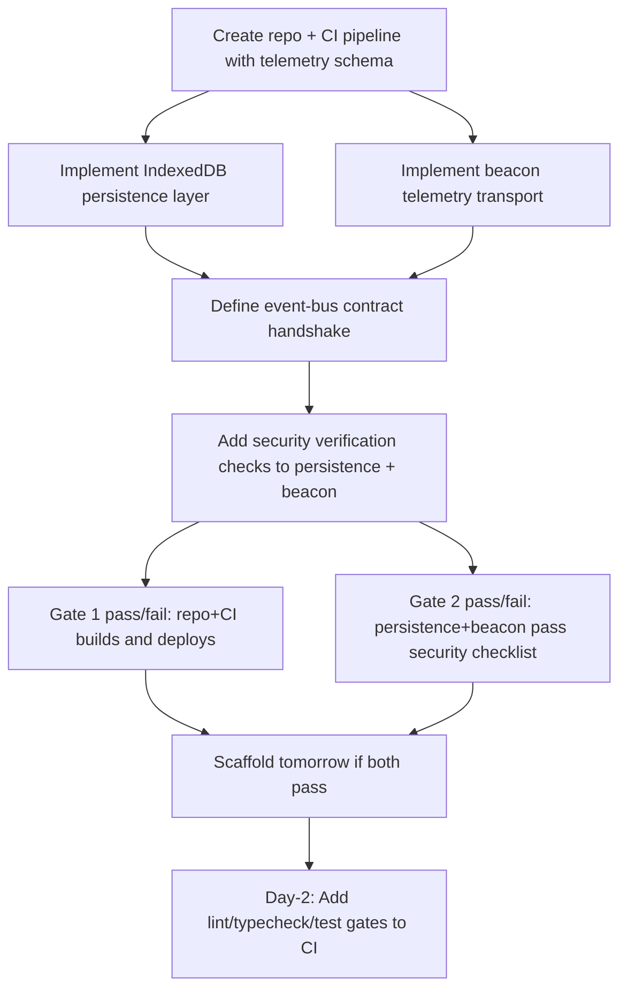

# Plan — Execution Spec — Asteroids Survivor: Three-Gate Scaffold Unblock

**Date:** 2026-09-15  
**Kind:** Technical  
**Status:** Planned  
**Audience:** coding agent — execute this spec, do not re-litigate  
**Project:** [[Project]]  
**Meeting:** `66c0c184`  

## Attendees & Ownership

- Product Manager
- Technical Engineering Manager
- Data Analyst
- QA Engineer
- Architect
- Lead Engineer
- Security Engineer
- DevOps Engineer
- UX/UI Designer
- Tech Researcher

## Goal
Ship Gate 1 (repo + CI with frozen telemetry schema) and Gate 2 (IndexedDB persistence + beacon telemetry with security checks) today so scaffold can run tomorrow. Gate 3 UX criteria (first-run: wave-1 completion without tutorial, controls discovered ≤5s, upgrade choice understood on first pick) published today for tomorrow's verification. Event-bus contract between persistence and beacon defined by TEM with four telemetry events and security checklist baked in.

## Locked decisions
- Three gates with pass/fail checks: Gate 1 repo+CI (Lead Engineer), Gate 2 persistence+beacon (TEM), Gate 3 playable core loop (owner unnamed) — [[ADR-three-gates]]
- Scaffold tomorrow if Gates 1 and 2 land today — [[ADR-scaffold-trigger]]
- Telemetry schema frozen in repo; minimal event-bus contract between persistence and beacon owned by TEM — [[ADR-event-bus-contract]]
- Security verification checklist on each gate: beacon sends only aggregated non-identifiable data; persistence stays local until opt-in — [[ADR-security-checklist]]
- CI pipeline cheap definition: single job `npm ci && npm run build && npx gh-pages -d dist`; lint/typecheck/test gates added post-scaffold as Day-2 task — [[ADR-ci-pipeline]]
- UX first-run criteria doc published today; event-bus requires four telemetry events from first-run criteria — [[ADR-ux-criteria]]

## Constraints
- Must: Zero backend for MVP — all state local (IndexedDB), analytics via client-side beacon to Plausible/Umami/Cloudflare Worker
- Must: Telemetry schema = tiny JSON `{ session_id, event_name, timestamp, properties }` sent via `navigator.sendBeacon()`
- Must: Persistence stays local until explicit opt-in; beacon sends only aggregated, non-identifiable data
- Must: Event-bus handshake defined by TEM; Lead Engineer exposes schema in repo
- Must: Security verification checklist added to each gate's done criteria
- Must-not: Block scaffold on lint/typecheck/test gates — those are Day-2 follow-up
- Out of scope: Leaderboard, backend, dual-mode compromise, performance budgets in CI (post-scaffold)

## Surfaces
- Repository root with `package.json`, GitHub Actions workflow (`.github/workflows/ci.yml`)
- Telemetry schema file (frozen in repo, e.g., `src/telemetry/schema.json` or `schemas/telemetry.json`)
- Persistence module: IndexedDB wrapper (e.g., `src/persistence/indexeddb.ts`)
- Beacon module: `navigator.sendBeacon` transport (e.g., `src/telemetry/beacon.ts`)
- Event-bus contract: minimal interface between persistence and beacon (e.g., `src/events/contract.ts`)
- Security verification checklist (e.g., `SECURITY_CHECKLIST.md` or embedded in gate docs)
- UX first-run criteria doc (operator artifact, e.g., `docs/first-run-criteria.md`)
- CI pipeline definition: single job `npm ci && npm run build && npx gh-pages -d dist`

## Execution graph

## Steps
1. `repo-root` — Initialize repository with `package.json` (build script, gh-pages deploy), GitHub Actions workflow `.github/workflows/ci.yml` running single job `npm ci && npm run build && npx gh-pages -d dist` on every `main` push — Acceptance: `git push origin main` triggers workflow, build succeeds, site deploys to gh-pages
2. `schemas/telemetry.json` — Write frozen telemetry schema: `{ "type": "object", "required": ["session_id","event_name","timestamp","properties"], "properties": { "session_id": {"type":"string"}, "event_name": {"type":"string"}, "timestamp": {"type":"number"}, "properties": {"type":"object"} } }` — Acceptance: file exists in repo, referenced by beacon module, immutable after push
3. `src/persistence/indexeddb.ts` — Implement IndexedDB wrapper with `init()`, `save(key, value)`, `load(key)`, `clear()`; enforce local-only (no network calls); export `Persistence` interface — Acceptance: unit test writes/reads round-trips in IndexedDB, no fetch/XHR calls in module
4. `src/telemetry/beacon.ts` — Implement `sendEvent(event: TelemetryEvent)` using `navigator.sendBeacon(endpoint, JSON.stringify(event))`; endpoint configurable via env `VITE_TELEMETRY_ENDPOINT`; validate payload against frozen schema before send — Acceptance: integration test posts to mock endpoint, payload matches schema, `sendBeacon` called
5. `src/events/contract.ts` — Define minimal event-bus contract: `PersistenceEvent` types (`save`, `load`, `clear`) and `BeaconEvent` types (four telemetry events: `first_run_start`, `wave1_complete_no_tutorial`, `controls_discovered`, `upgrade_choice_made`); handshake function `registerPersistenceBeaconBridge(persistence, beacon)` — Acceptance: TypeScript compiles, contract imports schema from `schemas/telemetry.json`, four event names match UX criteria
6. `src/persistence/indexeddb.ts` + `src/telemetry/beacon.ts` — Add security verification: persistence asserts no network access; beacon asserts `properties` contains no PII (no `user_id`, `ip`, `email`, `device_id`), `session_id` is UUIDv4, endpoint is allowlisted — Acceptance: security checklist passes (automated test or manual sign-off), no console errors on send
7. `docs/first-run-criteria.md` — (Operator) UX/UI Designer publishes first-run criteria doc with four telemetry events and pass/fail thresholds — Acceptance: doc exists, lists four events, thresholds: wave-1 completion without tutorial, controls discovered ≤5s, upgrade choice understood on first pick
8. `gate-verification` — Run Gate 1 pass/fail: CI workflow green, schema frozen; Gate 2 pass/fail: persistence+beacon tests pass, security checklist signed — Acceptance: both gates return PASS, scaffold unblocked
9. `scaffold` — (Tomorrow, DevOps) Run scaffold script / project initialization now that Gates 1 & 2 land — Acceptance: scaffold completes, playable core loop runs locally
10. `.github/workflows/ci.yml` — (Day-2, DevOps) Add lint/typecheck/test gates to CI pipeline (e.g., `npm run lint && npm run typecheck && npm run test`) — Acceptance: PR fails on lint/typecheck/test regression, main still deploys on green

## Verification
- Gate 1: `git push origin main` → GitHub Actions shows green build + gh-pages deploy; `schemas/telemetry.json` present and unchanged
- Gate 2: `npm test` (or equivalent) passes persistence + beacon tests; security checklist `SECURITY_CHECKLIST.md` has ✅ for aggregated-only beacon, local-only persistence
- Gate 3 (tomorrow): Scaffold runs; first-run playtest hits four telemetry events; UX criteria thresholds met
- Day-2: PR with lint error fails CI; main push still deploys on green

## Open risks
- Fourth telemetry event name not explicitly confirmed in transcript — UX/UI Designer said "four telemetry events" but only three criteria named; need clarification before contract finalization
- Event-bus contract handshake signature not fully specified — TEM owns definition; Lead Engineer exposes schema; exact function signature TBD
- Security checklist format not defined — automated test vs manual sign-off; Security Engineer to provide checklist template
- Scaffold script/command not named — DevOps to define tomorrow
- Performance budgets (LCP/CLS/INP/JS size) not in cheap CI — will be added Day-2 per expert recommendation
- Telemetry endpoint allowlist values not provided — need `VITE_TELEMETRY_ENDPOINT` values for Plausible/Umami/Cloudflare Worker

---

## Links

- [[Project]]
- Source meeting: `66c0c184`
