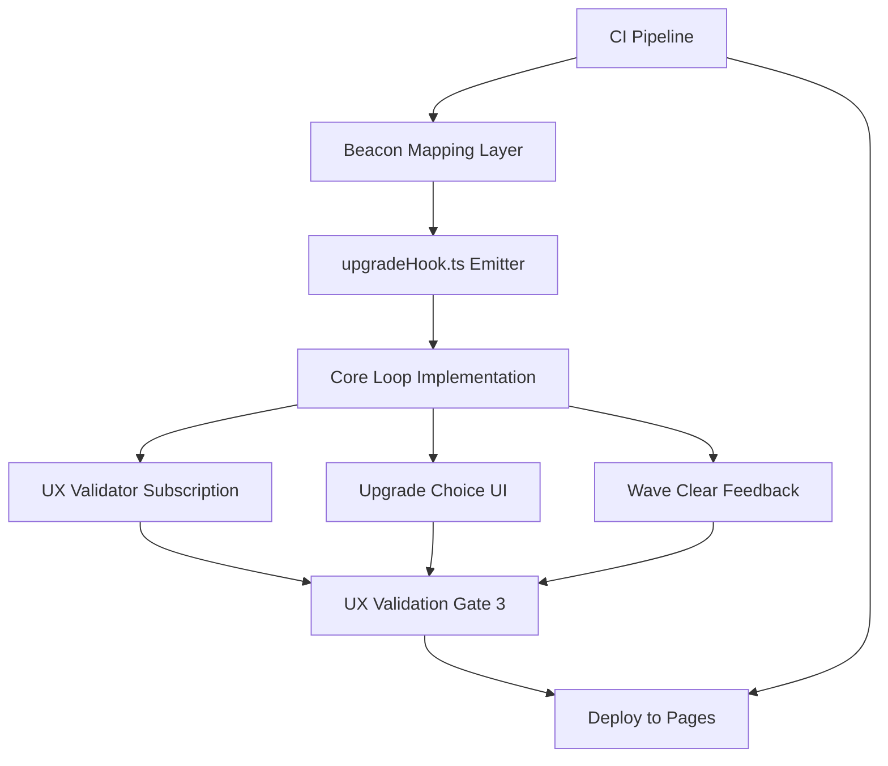

# Plan — Execution Spec — Ship Wave-1 Core Loop Increment

**Date:** 2026-09-15  
**Kind:** Full directive  
**Status:** Planned  
**Audience:** coding agent — execute this spec, do not re-litigate  
**Project:** [[Project]]  
**Meeting:** `9e074528`  

## Attendees & Ownership

- Product Manager
- Technical Engineering Manager
- Data Analyst
- Lead Engineer
- UX/UI Designer
- Architect
- Tech Researcher

## Goal
Ship the wave-1 core loop (move, auto-fire, XP, upgrade choice, wave clear) to GitHub Pages by 2026-09-16 with four locked telemetry events (session_start, wave_cleared, upgrade_chosen, session_end with duration) and a typed `upgrade_chosen` hook from `upgradeHook.ts`, gated by CI pipeline and validated against UX criteria (5-second control discovery, single-tap upgrade choice, juicy wave-clear feedback).

## Locked decisions
- Gate 3 = wave-1 core loop (move, auto-fire, XP, upgrade choice, wave clear) shipped to Pages tomorrow [[adr-001-registration-invocation]]
- Four telemetry events locked: session_start, wave_cleared, upgrade_chosen, session_end (with duration) — Data Analyst
- Retention success criteria: ≥35% Day-1, ≥12% Day-7 — Data Analyst
- Persistence layer stays pure — generic store-change hook only; telemetry module maps to beacon events — Architect
- upgrade_chosen hook mechanism: typed event emitter (mitt or minimal EventTarget) from dedicated `upgradeHook.ts` module; core loop emits, UX validator subscribes — Interview result, confirmed by TEM and Data Analyst
- Workstream ownership: Lead Engineer → CI; TEM → beacon mapping + core loop (mapping first) — Product Manager
- Security Engineer review async — blocks merge only, not start — Security Engineer
- Workbox queue is stretch; ship without it if day ends tight — Technical Engineering Manager
- No next-increment planning until current increment ships and retention data reviewed — Architect, Data Analyst, Lead Engineer, UX/UI Designer, Tech Researcher

## Constraints
- Must: CI pipeline (npm ci && build && gh-pages deploy) lands first to unblock merge
- Must: Beacon mapping layer (persistence hook → four beacon events) completes before core loop wires upgrade_chosen hook
- Must: Core loop implements move, auto-fire, XP, upgrade choice, wave clear
- Must: Upgrade choice presentation — one clear choice, text + icon, single tap/click, no hover-only affordances
- Must: Wave clear feedback — visible juicy moment surfacing upgrade, must not feel like pause screen
- Must: 5-second control discovery for first-time players
- Must-not: Couple persistence to UI logic; telemetry module only maps generic store-change to beacon events
- Out of scope: Workbox offline queue (stretch), next-increment planning, any feature beyond wave-1 core loop
- Hard deadline: Ship to Pages by 2026-09-16

## Surfaces
- `src/upgradeHook.ts` — exports typed event emitter for `upgrade_chosen` (mitt or minimal EventTarget)
- `src/persistence/` — generic store with store-change hook (already exists per Tech Researcher)
- `src/telemetry/` — mapping layer: subscribes to persistence store-change, emits four beacon events
- `src/core-loop/` — move, auto-fire, XP, upgrade choice, wave clear logic; imports `upgradeHook.ts`
- `src/ux-validator/` — subscribes to `upgrade_chosen` via `upgradeHook.ts` for UX validation
- `.github/workflows/ci.yml` — CI pipeline: npm ci, build, deploy to gh-pages
- `src/beacon.ts` — beacon payload types for four events (session_start, wave_cleared, upgrade_chosen, session_end with duration)
- `package.json` — build and deploy scripts

## Execution graph

## Steps
1. `.github/workflows/ci.yml` — Create CI workflow: `npm ci`, `npm run build`, deploy to `gh-pages` branch; trigger on push to main — Acceptance: `git push origin main` runs workflow, build succeeds, site live at `https://<owner>.github.io/<repo>/`
2. `src/beacon.ts` — Define TypeScript types for four beacon events: `SessionStart`, `WaveCleared`, `UpgradeChosen`, `SessionEnd` (with `durationMs`) — Acceptance: `tsc --noEmit` passes; types match Data Analyst payload spec
3. `src/telemetry/beaconMapper.ts` — Implement mapping layer: subscribe to persistence generic store-change hook; translate relevant state changes into four beacon events; emit via `navigator.sendBeacon` (or fetch with `keepalive`) — Acceptance: unit test fires store-change, verifies four beacon calls with correct payload shapes
4. `src/upgradeHook.ts` — Export typed event emitter (mitt or minimal EventTarget) with `emit('upgrade_chosen', upgradeId: string)` and `on('upgrade_chosen', handler)` — Acceptance: `tsc --noEmit` passes; importable by core loop and UX validator
5. `src/core-loop/index.ts` — Implement wave-1 core loop: player move (keyboard/touch), auto-fire at nearest target, XP accumulation, wave clear detection, upgrade choice trigger — Acceptance: manual playtest in browser shows move, auto-fire, XP bar, wave clear, upgrade choice appears
6. `src/core-loop/upgradeChoice.ts` — Wire upgrade choice: on wave clear, present single upgrade option (text + icon), emit `upgradeHook.emit('upgrade_chosen', upgradeId)` on single tap/click — Acceptance: click logs `upgrade_chosen` via hook; no hover-only affordance; choice clears on selection
7. `src/core-loop/waveClearFeedback.ts` — Implement juicy wave-clear moment: screen flash, particle burst, upgrade card slide-in (no pause-screen feel) — Acceptance: visual feedback triggers <100ms after last enemy destroyed; run momentum preserved (no full stop)
8. `src/ux-validator/upgradeValidator.ts` — Subscribe to `upgradeHook.on('upgrade_chosen', handler)`; validate 5-second control discovery (timer from wave clear to first interaction) and upgrade choice clarity (single choice rendered) — Acceptance: console logs validation metrics; 5-second threshold met in playtest
9. `src/main.ts` (or entry point) — Initialize persistence, telemetry, core loop, UX validator in correct order; register service worker for gh-pages (optional, stretch) — Acceptance: app loads, all modules wired, no console errors
10. `package.json` — Ensure `build` script outputs to `dist/` for gh-pages; add `deploy` script if not present — Acceptance: `npm run build` produces `dist/index.html` and assets; `npm run deploy` pushes to `gh-pages`

## Verification
- CI workflow passes on main branch push (green check in Actions)
- Site loads at GitHub Pages URL with no console errors
- Playtest: move → auto-fire → XP gain → wave clear → upgrade choice appears → single tap selects → `upgrade_chosen` beacon fires → next wave starts
- Telemetry debug: open Network tab, filter "beacon" — verify four event types fire with correct payloads
- UX validation: 5-second control discovery timer logs ≤5000ms; upgrade choice shows one option with text+icon; wave-clear feedback feels juicy, not pause-like
- Retention probe live: session_start on load, session_end on unload (with duration), wave_cleared per wave, upgrade_chosen per choice

## Open risks
- Exact persistence store-change hook signature not named in room — need to inspect `src/persistence/` to subscribe correctly
- `mitt` vs minimal `EventTarget` choice for `upgradeHook.ts` not finalized — pick one and document in code
- gh-pages deploy target branch (`gh-pages` vs `docs/`) not confirmed — check repo settings
- Service worker / Workbox queue (stretch) — if time permits, add offline beacon queue; otherwise skip
- Security Engineer async review may block merge after CI passes — ensure PR ready for review immediately after CI green
- Date 2026-09-16 is tomorrow — if any step slips, Workbox queue and polish are first cuts

---

## Links

- [[Project]]
- Source meeting: `9e074528`
