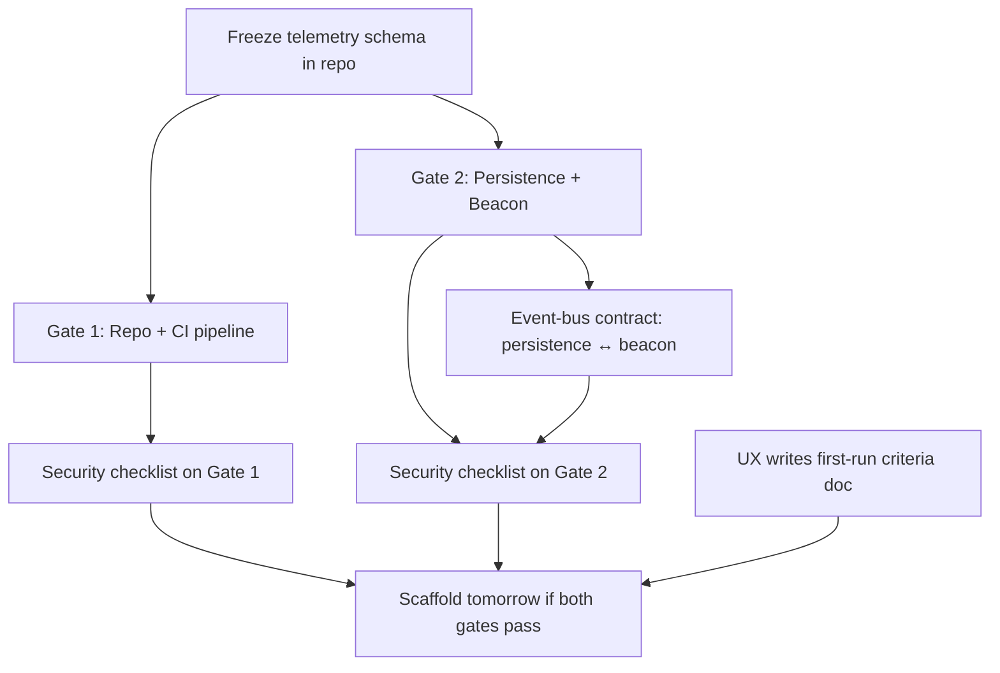

# Plan — todo integrations — Execution Spec

**Date:** 2026-09-15  
**Kind:** Technical  
**Status:** Planned  
**Audience:** coding agent — execute this spec, do not re-litigate  
**Project:** [[Project]]  
**Meeting:** `66c0c184`  

## Attendees & Ownership

- Product Manager
- Technical Engineering Manager
- Data Analyst
- QA Engineer
- Architect
- Lead Engineer
- Security Engineer
- DevOps Engineer
- UX/UI Designer
- Tech Researcher

## Goal
Ship Gate 1 (repo + CI with frozen telemetry schema) and Gate 2 (IndexedDB persistence + `navigator.sendBeacon` telemetry beacon with security checks) today so scaffold can proceed tomorrow. Gate 3 (playable core loop) gets UX acceptance criteria written today for tomorrow's verification. Event-bus contract between persistence and beacon is owned by TEM with security checklist baked in.

## Locked decisions
- Three gates with pass/fail checks: Gate 1 repo+CI (Lead Engineer), Gate 2 persistence+beacon (Technical Engineering Manager), Gate 3 playable core loop (owner unnamed) — [[ADR-three-gates]]
- Scaffold tomorrow if Gates 1 and 2 land today — [[ADR-scaffold-trigger]]
- Security verification checklist on each gate: telemetry beacon sends only aggregated, non-identifiable data; persistence stays local until opt-in — [[ADR-security-checklist]]
- Telemetry schema frozen in repo (session_id, event_name, timestamp, properties) — [[ADR-telemetry-schema]]
- Minimal event-bus contract between persistence and beacon owned by TEM; Lead Engineer exposes schema — [[ADR-event-bus-contract]]
- CI pipeline: cheap budget single job `npm ci && npm run build && npx gh-pages -d dist` — [[ADR-ci-pipeline]]
- DevOps adds lint/typecheck/test gates to CI after scaffold as Day-2 task, not a blocker — [[ADR-ci-day2]]
- UX acceptance criteria for Gate 3: first-run completes wave 1 without tutorial, controls discovered in ≤5s, upgrade choice understood on first pick — [[ADR-ux-criteria]]
- Event-bus requires four telemetry events for first-run criteria — [[ADR-four-events]]

## Constraints
- Must: Zero backend for MVP — all state local (IndexedDB), analytics via client-side beacon to Plausible/Umami
- Must: Telemetry beacon uses `navigator.sendBeacon()` with frozen JSON schema
- Must: Persistence stays local until explicit opt-in
- Must: Security verification checklist passes on each gate before scaffold
- Must-not: Lint/typecheck/test gates block scaffold (Day-2 only)
- Out of scope: Leaderboard, backend services, dual-mode compromise

## Surfaces
- Repo root with `package.json`, GitHub Actions workflow (`.github/workflows/ci.yml`)
- Telemetry schema file (location not named — infer: `src/telemetry/schema.json` or similar)
- Persistence module (IndexedDB wrapper — area: `persistence`)
- Beacon module (`navigator.sendBeacon` transport — area: `beacon`)
- Event-bus contract (minimal interface between persistence and beacon — area: `event-bus`)
- Security verification checklist (added to each gate's done criteria — area: `security`)
- UX first-run criteria doc (operator artifact — area: `ux/criteria.md`)
- CI pipeline: single job `npm ci && npm run build && npx gh-pages -d dist`

## Execution graph

## Steps
1. `repo` — Initialize repo with `package.json`, TypeScript config, and frozen telemetry schema (`session_id`, `event_name`, `timestamp`, `properties`) — Acceptance: schema file committed, `npm ci` succeeds
2. `.github/workflows/ci.yml` — Add cheap CI pipeline: single job `npm ci && npm run build && npx gh-pages -d dist` on every `main` push — Acceptance: workflow runs green on push
3. `persistence` — Implement IndexedDB wrapper for local-only state (no network calls) — Acceptance: unit test writes/reads round-trip in IndexedDB, no fetch/XHR observed
4. `beacon` — Implement `navigator.sendBeacon()` transport sending frozen schema events to managed endpoint (Plausible/Umami) — Acceptance: beacon fires with correct schema, payload inspected shows only aggregated non-identifiable fields
5. `event-bus` — Define minimal contract (four events: `session_start`, `wave1_complete`, `control_discovered`, `upgrade_picked`) and handshake between persistence and beacon — Acceptance: contract doc + TypeScript interfaces committed, persistence emits, beacon consumes
6. `security` — Add security verification checklist to Gate 1 and Gate 2 done criteria: verify beacon payload has no PII, persistence has no network access, opt-in flag defaults false — Acceptance: checklist passes in CI logs for both gates
7. `ux/criteria.md` — UX/UI Designer publishes first-run criteria doc (wave 1 completion without tutorial, ≤5s control discovery, upgrade choice understood on first pick) — Acceptance: doc exists and references four telemetry events
8. `scaffold` — If Gates 1 and 2 pass (CI green + security checklist pass), run scaffold tomorrow — Acceptance: scaffold command executes without error

## Verification
- Gate 1 pass: CI workflow green on `main` + security checklist passes (schema frozen, no PII in beacon)
- Gate 2 pass: Persistence IndexedDB tests green + beacon sends correct schema + security checklist passes (local-only, aggregated-only)
- Gate 3 ready: UX criteria doc published + four telemetry events defined in event-bus contract
- Scaffold trigger: Both Gate 1 and Gate 2 pass today → scaffold runs tomorrow

## Open risks
- Gate 3 owner unnamed — who owns playable core loop implementation?
- Exact file paths for telemetry schema, persistence, beacon, event-bus not named in room — infer from area labels
- Managed analytics endpoint (Plausible/Umami/Cloudflare Worker) not selected — need operator decision
- Security checklist format not specified — need checklist template
- Scaffold command/target not defined — need DevOps clarification
- Date for "tomorrow" scaffold not given as YYYY-MM-DD — room date is 2026-09-15, so scaffold likely 2026-09-16

---

## Links

- [[Project]]
- Source meeting: `66c0c184`
