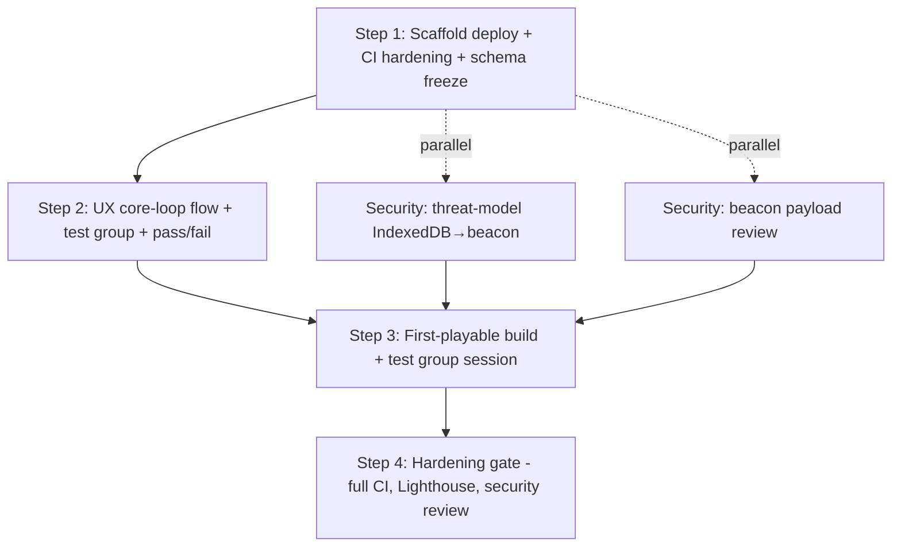

# Prompt — Execute — Execution Spec — Plan the first increment — ordered

**Category:** execution  
**Target Role / Room:** coding agent  
**Version:** 1.0  
**Date:** 2026-09-11  
**Project:** [[Project]]  

## Purpose & Scope

Hand the "Execution Spec — Plan the first increment — ordered" plan to a coding agent for implementation.

## System Prompt / Instructions

~~~~markdown
# Execute: Execution Spec — Plan the first increment — ordered

You are implementing a plan that has already been decided. Your job is to execute it, not to redesign it.

## Context

- Project: Asteroids Survivor
- What it is: Classic Asteroids arcade game, with vampire survivor mechanics
- Repository: `E:\Desarrollos\proyectos\Asteroids`
- This plan came out of a Full directive meeting on "Plan the first increment — ordered". Those decisions are settled.
- Source plan: `Plans/2026-09-11-execution-spec-plan-first.md`
- Current plan pointer: `E:/Desarrollos/proyectos/Asteroids/docs/Plans/2026-09-11-execution-spec-plan-first.md`

## Goal

Ship a 12-day MVP increment for Asteroids Survivor: scaffold deploy (Step 1), UX core-loop flow + test-group definition (Step 2), first-playable session with named test group (Step 3), and hardening gate (Step 4). Scope is strictly core loop + local persistence (IndexedDB) + deploy to GitHub Pages; everything else is a seat todo.

## Already settled

- Scope locked to core loop + local persistence + deploy; everything else is a seat todo — **Product Manager**
- Step 1 (scaffold deploy) starts **2026-09-12** with current CI (lint + typecheck only) — **Technical Engineering Manager**, **Sales Manager**
- Telemetry schema freezes **today (2026-09-11)** before Step 1 ships — **Data Analyst**, **QA Engineer**, **Security Engineer**, **Lead Engineer**
- CSP header + `npm audit` added to Step 1 CI job — **Security Engineer**
- Security review of beacon payload is a blocker; moves from post-increment to parallel gate before Step 3 — **Security Engineer**
- UX delivers one-page core loop flow + test group definition + pass/fail criteria **2026-09-12 09:00** — **UX/UI Designer**, **Product Manager**
- Named test group: 3 weekly browser-arcade players (1 streamer, 1 speedrunner, 1 casual), recruited by **2026-09-18**, session **2026-09-21 10:00** — **UX/UI Designer**
- Pass/fail criteria: survive 90s on first life AND hit "continue" after death without asking what to do — **UX/UI Designer**
- Retention targets: Day-1 ≥ 35%, Day-7 ≥ 12% (industry baseline) — **Data Analyst**
- Step 4 gates all remaining hardening (full CI gates, Lighthouse budgets, security review completion) — **Lead Engineer**, **Product Manager**
- Lead Engineer to confirm stack ADR is recorded so scaffold doesn't churn — **Technical Engineering Manager**, **Lead Engineer**
- Threat-model IndexedDB→beacon before Step 3 — **Security Engineer**

Pinned vault facts (one-line; open the file, do not dump it):
- **Plan the first increment — ordered** [meeting] (`Meetings/2026-09-11-plan-first-increment-ordered.md`) — Meeting note on Plan the first increment — ordered.
- **Plan the first increment — ordered** [meeting] (`Meetings/2026-09-11-plan-first-increment-ordered.md`) — Meeting note on Plan the first increment — ordered.

## Constraints

- Must: Freeze telemetry schema **today (2026-09-11)** before Step 1 ships
- Must: Add CSP header + `npm audit` to CI job in Step 1
- Must: Security review of beacon payload completes before Step 3 (gate, not follow-up)
- Must: UX flow doc + test group + pass/fail delivered **2026-09-12 09:00**
- Must: Test group recruited by **2026-09-18**, session **2026-09-21 10:00**
- Must: Retention targets (Day-1 ≥ 35%, Day-7 ≥ 12%) defined before Step 1
- Must-not: Add lint/typecheck/unit-test gates to CI in Step 1 (current CI only: lint + typecheck)
- Must-not: Build any backend, leaderboard, or multiplayer — zero backend for MVP
- Out of scope: Full CI gates (unit test, Lighthouse), complete security hardening, analytics dashboard, onboarding polish — all gate Step 4
- Lead Engineer must confirm stack ADR location before Step 1 starts

## Surfaces

- **CI pipeline** (GitHub Actions): single job `npm ci && npm run build && npx gh-pages -d dist`; Step 1 adds CSP header + `npm audit`; Step 4 adds lint + typecheck + unit test + Lighthouse CI budgets (LCP ≤ 2.5s, CLS ≤ 0.1, INP ≤ 200ms, total JS ≤ 170kB gzipped)
- **Telemetry schema**: JSON events `{ session_id, event_name, timestamp, properties }` sent via `navigator.sendBeacon()` to managed endpoint (Plausible/Umami/Cloudflare Worker) — schema frozen **2026-09-11**
- **Local persistence**: IndexedDB for game state (high score, progress, settings)
- **Deploy target**: GitHub Pages (`gh-pages` branch via `npx gh-pages -d dist`)
- **Stack ADR**: location TBD — Lead Engineer to confirm
- **UX flow doc**: one-page core loop flow + test group definition + pass/fail criteria (delivered 2026-09-12 09:00)
- **Security review**: threat-model IndexedDB→beacon; beacon payload review blocks Step 3

## The plan

## Tasks

1. **telemetry/schema** — Freeze JSON event schema today: `{ "session_id": "string", "event_name": "string", "timestamp": "ISO8601", "properties": "object" }`; document in `docs/telemetry-schema.json`; add `navigator.sendBeacon()` client in `src/telemetry/beacon.ts` with endpoint configurable via `VITE_TELEMETRY_ENDPOINT`
   - Done when: schema file committed, beacon client compiles, no schema changes after 2026-09-11

2. **stack/adr** — Lead Engineer confirms stack ADR location and records decision (Vite + TypeScript + Phaser 3 + IndexedDB + GitHub Pages)
   - Done when: ADR file linked in `docs/adr/001-stack-choice.md` with status "Accepted"

3. **ux/core-loop-flow** — UX/UI Designer delivers one-page core loop flow doc (`docs/ux/core-loop-flow.md`) by 2026-09-12 09:00 covering: first-run experience, what persists (IndexedDB keys), return-visit flow, and embedded test group definition (3 players: streamer, speedrunner, casual; recruited by 2026-09-18; session 2026-09-21 10:00) + pass/fail criteria (survive 90s first life + hit "continue" after death without asking)
   - Done when: doc exists at path, contains all 4 sections, pass/fail criteria match verbatim

4. **game/scaffold** — Implement minimal playable scaffold: Phaser 3 scene with ship movement, asteroid spawning, collision → death, "continue" button, IndexedDB persistence (high score, last run timestamp), telemetry beacon on `session_start`, `death`, `continue_click`
   - Done when: `npm run build` succeeds, `dist/` deploys to Pages, local play shows ship + asteroids + death + continue, IndexedDB writes on death, beacon fires on 3 events

5. **security/threat-model** — Security Engineer completes threat-model of IndexedDB→beacon data flow (document in `docs/security/threat-model-indexeddb-beacon.md`)
   - Done when: doc identifies data classification, trust boundaries, mitigation for PII leakage, signed by Security Engineer

6. **security/beacon-review** — Security Engineer reviews beacon payload schema + transport; approves or requests changes
   - Done when: written approval in `docs/security/beacon-review.md` or blocking issues listed; must complete before Step 3 session

7. **test-group/recruit** — UX/UI Designer + Product Manager recruit 3 named testers (streamer, speedrunner, casual) by 2026-09-18; record handles + contact in `docs/ux/test-group.md`
   - Done when: 3 testers confirmed, available 2026-09-21 10:00

8. **test-group/session** — Conduct observed session 2026-09-21 10:00: each tester plays first-playable build; facilitator records pass/fail per criteria (survive 90s first life + hit "continue" without asking)
   - Done when: session notes in `docs/ux/session-2026-09-21.md` with pass/fail per tester; ≥2/3 pass to proceed

9. **ci/hardening** — Add full CI gates: `npm run test:unit`, Lighthouse CI step with budgets (LCP ≤ 2.5s, CLS ≤ 0.1, INP ≤ 200ms, total JS ≤ 170kB gzipped); fail PR on regression
   - Done when: PR with failing budget is blocked; green PR deploys with budgets met

10. **security/hardening** — Complete remaining security hardening: CSP report-only → enforce, dependency audit baseline, beacon endpoint allowlist
   - Done when: CSP enforced in production, `npm audit` clean, beacon endpoint locked to allowlist

## Operator work

Not for the coding agent. Do not implement these in the repository.

1. **ci/pipeline** — Add CSP header (`Content-Security-Policy: default-src 'self'; script-src 'self'; style-src 'self' 'unsafe-inline'; img-src 'self' data:; connect-src 'self' https://*.plausible.io https://*.umami.is`) and `npm audit --audit-level=high` to existing GitHub Actions job; keep job as `npm ci && npm run lint && npm run typecheck && npm run build && npx gh-pages -d dist`
   - Done when: CI passes on `main` push with CSP header present in deployed `index.html` response and `npm audit` exits 0

## Definition of done

- Step 1 CI passes with CSP + audit on 2026-09-12
- Telemetry schema frozen and documented by 2026-09-11 EOD
- UX flow doc delivered 2026-09-12 09:00 with test group + pass/fail
- Stack ADR recorded before 2026-09-12
- First-playable builds and deploys by 2026-09-19 (pre-session)
- Security threat-model + beacon review complete before 2026-09-21
- Test group session runs 2026-09-21 10:00 with ≥2/3 pass
- Step 4 hardening gates merge to `main` after session

- Every "Done when" above holds.
- The project's tests pass, or you have said exactly which ones do not and why.
- The diff contains nothing outside these tasks.
- The plan note `Plans/2026-09-11-execution-spec-plan-first.md` is marked finished: set `status: completed` in its YAML frontmatter and change its `**Status:**` line to `Completed`. Do this only once every task above is genuinely done — it is what tells the project the plan is closed.

## Open risks

- Schema freeze not completed today (2026-09-11) before Step 1 ships tomorrow — **execution blocker**
- Stack ADR location unconfirmed — Lead Engineer must confirm before 2026-09-12
- Security beacon review may require schema changes after freeze — conflicts with "schema frozen today"
- Test group recruitment by 2026-09-18 — no backup plan if streamer/speedrunner/casual unavailable
- 12-day timeline assumes no churn in Step 1 scaffold; any scope creep breaks Step 3 date
- Lighthouse budgets (Step 4) not yet validated against Phaser 3 bundle size — may exceed 170kB JS budget

Do not fill these in. Stop and say so if they block a task.

## Ground rules

- Work through the tasks in order — they are sequenced by dependency.
- Stay inside the scope of these tasks. Anything you notice but was not asked for goes in your final report, not into the diff.
- Match the conventions of the code already around you rather than importing your own.
- Run the project's tests (or the closest equivalent) before you call a task done, and say what you ran.
- Do not delete or overwrite files that are not part of a task, and confirm before any irreversible action.

## If the plan is wrong

If a task turns out to be impossible, already done, or contradicted by the code, stop at that task and say so,
with what you found. Do not substitute your own design for the one that was agreed.

## Reference material

Background the council relied on. Read what you need; do not treat it as more tasks.

- **Client-side telemetry schema & transport** [definition] (`Definitions/client-side-telemetry-schema.md`) — Expert recommendation: Define a tiny JSON event schema (session_id, event_name, timestamp, properties) sent via `navigator.sendBeacon()` to a managed analytics endpoint (e.g., Plausible, Umami, or a Cloudflare Worker) — zero backend code, w
- **CI pipeline definition** [definition] (`Definitions/ci-pipeline-definition.md`) — Cheap budget: Single job: `npm ci && npm run build && npx gh-pages -d dist`; no lint/typecheck/test gates, deploy on every `main` push.
- **Roadmap — Plan the first increment — ordered** [roadmap] (`Roadmaps/dcd07828-roadmap.md`) — Strategic implementation roadmap for Plan the first increment — ordered.
- **Minutes — Plan the first increment — ordered** [minutes] (`Minutes/2026-09-11-plan-first-increment-ordered-minutes.md`) — Minutes for Plan the first increment — ordered.
~~~~

## Expected Output Format

The 11 tasks implemented in order, each meeting its acceptance criterion.

---

## Links

- [[Project]]
- [[Index]]
