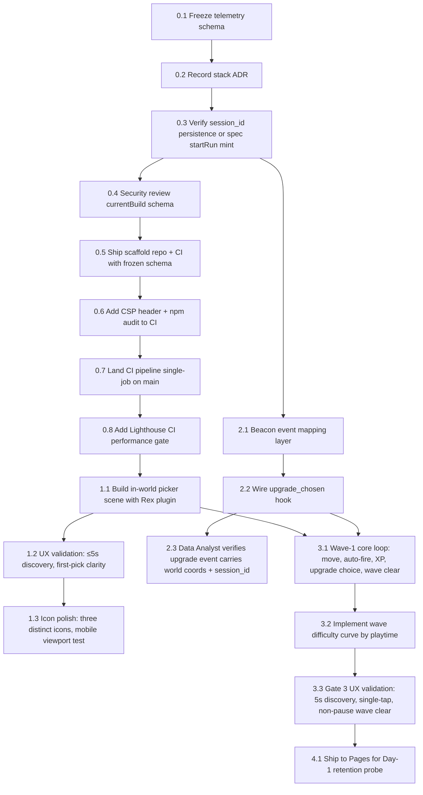
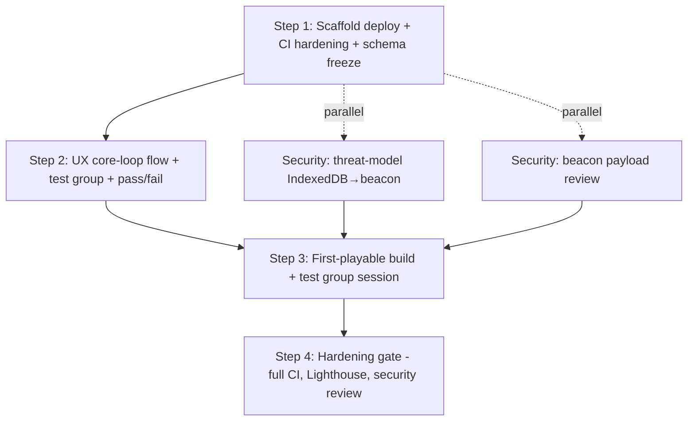

# Prompt — Execute — Execution Spec — In-World Picker Scene & Day-1 Retention Probe

**Category:** execution  
**Target Role / Room:** coding agent  
**Version:** 1.0  
**Date:** 2026-09-17  
**Project:** [[Project]]  

## Purpose & Scope

Hand the "Execution Spec — In-World Picker Scene & Day-1 Retention Probe" plan to a coding agent for implementation.

## System Prompt / Instructions

~~~~markdown
# Execute: Execution Spec — In-World Picker Scene & Day-1 Retention Probe

You are implementing a plan that has already been decided. Your job is to execute it, not to redesign it.

## Context

- Project: Asteroids Survivor
- What it is: Classic Asteroids arcade game, with vampire survivor mechanics
- Repository: `E:\Desarrollos\proyectos\Asteroids`
- This plan came out of a Technical meeting on "Lead Engineer builds in-world picker scene with Rex plugin (pauses physics, +18". Those decisions are settled.
- Source plan: `Plans/2026-09-17-execution-spec-world-picker.md`
- Current plan pointer: `E:/Desarrollos/proyectos/Asteroids/docs/Plans/2026-09-17-execution-spec-world-picker.md`

## As built

Current repo — extend it. Do not reverse a shipped increment or a frozen lock unless a Locked decision in this plan explicitly says to replace it.

Open plan (not yet shipped): **Plan — Execution Spec — In-World Picker Scene & Day-1 Retention Probe** (`Plans/2026-09-17-execution-spec-world-picker.md`)

Code snapshot:
- Asteroids Survivor: Classic Asteroids arcade game, with vampire survivor mechanics
- Stack: Node.js, TypeScript
- Top directories: docs, src
- Files: 17
- Git: main @ "Merge remote-tracking branch 'origin/claude/charming-thompson-qrs4la'"

Current accepted locks:
- Expert recommendation: Use a typed event emitter (e.g., `mitt` or a minimal custom `EventTarget`) exported from a ded… [[adr-001-registration-invocation]]

Living definitions (one-line; open the file, do not dump it):
- **Lead Engineer builds in-world picker scene with Rex plugin (pauses physics, +18** [meeting] (`Meetings/2026-09-17-lead-engineer-builds-world.md`) — Meeting note on Lead Engineer builds in-world picker scene with Rex plugin (pauses physics, +18.
- **Minutes — Lead Engineer builds in-world picker scene with Rex plugin (pauses physics, +18** [minutes] (`Minutes/2026-09-17-lead-engineer-builds-world-minutes.md`) — Minutes for Lead Engineer builds in-world picker scene with Rex plugin (pauses physics, +18.

## Goal

Ship a Day-1 retention probe to GitHub Pages consisting of: (1) a frozen telemetry schema with `session_id` persistence verified, (2) a scaffold repo with minimal CI + Lighthouse gate, (3) an in-world upgrade picker scene built with the Rex plugin that pauses physics and renders world coordinates, (4) a three-option upgrade picker (three distinct icons, one-tap, no scroll, ≤5 s mobile discovery), (5) beacon event mapping for `upgrade_chosen` with world coords + `session_id`, (6) Wave-1 core loop (move, auto-fire, XP, upgrade choice, wave clear) with playtime-driven difficulty curve, and (6) UX validation gates 1–3 passing in PR checklist. Meta-progression, full CI hardening, Workbox, leaderboard, and backend are explicitly out of scope.

## Already settled

- Telemetry schema frozen: `session_id`, `event_name`, `timestamp`, `properties` — Data Analyst
- Phase 0 executes today; Phase 1 starts tomorrow; Phases 2–3 follow dependencies; Phase 4 deploys to Pages — Product Manager
- Stack ADR recorded (typed event emitter: `mitt` or minimal custom `EventTarget`) — [[adr-001-registration-invocation]] — Lead Engineer
- Security Engineer reviews `currentBuild` schema (local-only `Upgrade[]`, no new telemetry IDs) after telemetry ADR freeze and `session_id` persistence confirmed — Security Engineer
- DevOps Engineer owns CI pipeline (0.6) and Lighthouse budgets (0.7), both landing after scaffold (0.4) and Security CSP/audit (0.5) — DevOps Engineer / Technical Engineering Manager
- QA Engineer writes Gate 1–3 pass/fail criteria (session_id persistence, bundle budget, event-bus contract, schema freeze) to PR checklist today — QA Engineer
- UX/UI Designer owns ≤5 s discovery check and first-pick clarity pass for Picker UX validation, dependency on Lead Engineer's Rex scene (1.1) — UX/UI Designer
- Data Analyst verifies `storage.ts` persists stable `session_id` across browser close or specifies `startRun()` mint implementation today — Data Analyst
- Meta-progression, full CI hardening (lint/typecheck/test gates), Workbox, leaderboard, backend are NOT this increment — Product Manager

Pinned vault facts (one-line; open the file, do not dump it):
- **Lead Engineer builds in-world picker scene with Rex plugin (pauses physics, +18** [meeting] (`Meetings/2026-09-17-lead-engineer-builds-world.md`) — Meeting note on Lead Engineer builds in-world picker scene with Rex plugin (pauses physics, +18.
- **Lead Engineer builds in-world picker scene with Rex plugin (pauses physics, +18** [meeting] (`Meetings/2026-09-17-lead-engineer-builds-world.md`) — Meeting note on Lead Engineer builds in-world picker scene with Rex plugin (pauses physics, +18.

## Constraints

- **Must**: `session_id` persistence decision (storage.ts or `startRun()` mint) lands today — blocks beacon mapping (Phase 2)
- **Must**: Telemetry ADR frozen and committed before scaffold ships — Lead Engineer
- **Must**: Security sign-off on `currentBuild` schema before merge — Security Engineer
- **Must**: CI green on `main` with single-job pipeline (no lint/typecheck/test gates per PROJECT LANGUAGE) — Technical Engineering Manager / DevOps Engineer
- **Must**: Lighthouse CI gate with JS ≤ 170 kB gzipped budget — Technical Engineering Manager / DevOps Engineer
- **Must**: Rex plugin bundle impact stays inside Step 4 budget — unmeasured, Lead Engineer to verify
- **Must**: UX validation criteria testable tomorrow; vague criteria blocks Gate 3 — UX/UI Designer
- **Must not**: Reopen concept or locked stack issues (ADR-001 settled)
- **Out of scope**: Meta-progression, full CI hardening (Day-2), Workbox, leaderboard, backend, any telemetry IDs beyond frozen schema

## Surfaces

Files, modules, endpoints, data shapes, env vars, and commands the room named:
- `storage.ts` — session_id persistence (verify or spec `startRun()` mint)
- `currentBuild` schema — local-only `Upgrade[]`, no new telemetry IDs (Security review)
- Telemetry schema: `{ session_id: string, event_name: string, timestamp: number, properties: Record<string, unknown> }` — frozen
- `upgrade_chosen` hook — beacon event mapping layer (Technical Engineering Manager)
- `shatter()` hook, `DEATH_EVENT` piggyback — game flow wiring (Technical Engineering Manager)
- Rex plugin — in-world picker scene, pauses physics, renders world coords (Lead Engineer)
- Three-option upgrade picker — three distinct icons, one-tap, no scroll (UX/UI Designer + Lead Engineer)
- Wave difficulty curve — driven by playtime, not player level (Lead Engineer)
- GitHub Pages deploy — Day-1 retention probe (Technical Engineering Manager)
- CI pipeline — single job, CSP header, `npm audit` (DevOps Engineer / Technical Engineering Manager)
- Lighthouse CI — performance gate, JS ≤ 170 kB gzipped (DevOps Engineer / Technical Engineering Manager)
- PR checklist — Gate 1–3 pass/fail criteria (QA Engineer)
- ADR files — stack ADR (recorded), telemetry ADR (to freeze) (Lead Engineer)

## The plan

## Atlas

Copied from the living atlas. Do not redraw. Do not treat as new tasks.

### You

## Tasks

1. **telemetry/schema.ts** — Freeze telemetry schema: export `TelemetryEvent = { session_id: string; event_name: string; timestamp: number; properties: Record<string, unknown> }`; commit to `main`
   - Done when: schema file exists, no further edits after commit, Data Analyst signs off in PR

2. **docs/adr/adr-001-registration-invocation.md** — Confirm stack ADR recorded (typed event emitter: `mitt` or minimal custom `EventTarget`); ensure committed
   - Done when: ADR file present in repo, linked in README

3. **storage.ts** — Verify `session_id` persists stable across browser close (localStorage/IndexedDB) OR write `startRun()` mint spec that generates cryptographically random `session_id` on each run start; commit decision
   - Done when: Data Analyst confirms persistence works or `startRun()` spec merged; QA adds Gate 1 check to PR checklist

4. **src/security/currentBuild.ts** — Security Engineer reviews `currentBuild` schema (local-only `Upgrade[]`, no new telemetry IDs); written approval in PR
   - Done when: Security Engineer comment "approved" on PR, no blocking findings

5. **scaffold/** — Ship scaffold (Step 1): repo structure with frozen telemetry schema, minimal `package.json`, TypeScript config, entry point; push to `main`
   - Done when: `main` builds, CI job runs, schema imported without error

6. **.github/workflows/ci.yml** — Add CSP header middleware + `npm audit` step to CI job; ensure job passes on `main`
   - Done when: CI green on `main`, CSP header present in response headers, `npm audit` exits 0 (or only advisories)

7. **.github/workflows/ci.yml** — Land single-job CI pipeline on `main` (build + CSP + audit); no lint/typecheck/test gates per PROJECT LANGUAGE
   - Done when: PR merges only when CI green on `main`; breakage = deploy failure

8. **.github/workflows/lighthouse.yml** — Add Lighthouse CI performance gate with budget: JS ≤ 170 kB gzipped; fail PR if exceeded
   - Done when: Lighthouse runs on PR, budget enforced, first build measured

9. **src/scenes/PickerScene.ts** — Build in-world picker scene with Rex plugin: pause physics (`this.physics.pause()`), render upgrade options at world coordinates, three distinct icons, one-tap selection, no scroll/tooltip
   - Done when: Scene loads, physics pauses, three icons visible at world coords, tap selects, no scroll needed

10. **ux/validation/picker-discovery.md** — UX/UI Designer validates ≤5 s control discovery on mobile (three icons, one-tap, no scroll/tooltip hunt); documents pass/fail with device viewport
   - Done when: Timed test ≤5 s on mobile viewport, first-pick clarity pass, doc committed

11. **src/ui/UpgradeIcons.tsx** — Polish three distinct icons for mobile viewport clarity (test at 32×32 dp); ensure no scroll, one-tap hit targets ≥48×48 dp
   - Done when: Icons render clearly at 32×32, hit targets meet 48×48, no overflow scroll

12. **src/telemetry/beacon.ts** — Implement beacon event mapping layer: `sendUpgradeChosen(upgradeId: string, worldCoords: {x:number,y:number}, sessionId: string)` posts to endpoint; uses frozen schema
   - Done when: Function exists, typed with frozen schema, unit test stub passes

13. **src/game/upgradeHooks.ts** — Wire `upgrade_chosen` hook into game flow: called on picker selection, emits beacon event with world coords + `session_id`
   - Done when: Hook fires on selection, beacon receives correct payload, Data Analyst verifies in network tab

14. **src/telemetry/verify.ts** — Data Analyst verifies `upgrade` event carries world coords + `session_id` in beacon; logs sample payload
   - Done when: Sample payload logged, matches frozen schema, `session_id` stable across runs

15. **src/scenes/GameScene.ts** — Implement Wave-1 core loop: move (pointer/keyboard), auto-fire, XP accumulation, upgrade choice at threshold, wave clear (non-pause), `shatter()` hook, `DEATH_EVENT` piggyback
   - Done when: Loop runs end-to-end in browser, upgrade choice appears at XP threshold, wave clears without pausing physics

16. **src/game/difficultyCurve.ts** — Implement wave difficulty curve driven by playtime

## Definition of done

- Every "Done when" above holds.
- The project's tests pass, or you have said exactly which ones do not and why.
- The diff contains nothing outside these tasks.
- The plan note `Plans/2026-09-17-execution-spec-world-picker.md` is marked finished: set `status: completed` in its YAML frontmatter and change its `**Status:**` line to `Completed`. Do this only once every task above is genuinely done — it is what tells the project the plan is closed.

## Ground rules

- Work through the tasks in order — they are sequenced by dependency.
- Stay inside the scope of these tasks. Anything you notice but was not asked for goes in your final report, not into the diff.
- Match the conventions of the code already around you rather than importing your own.
- Run the project's tests (or the closest equivalent) before you call a task done, and say what you ran.
- Do not delete or overwrite files that are not part of a task, and confirm before any irreversible action.

## If the plan is wrong

If a task turns out to be impossible, already done, or contradicted by the as-built code or a locked decision, stop at that task and say so,
with what you found. Do not substitute your own design. Do not reverse a shipped increment or a frozen schema unless a Locked decision in this plan explicitly says to replace it.

## Reference material

Background the council relied on. Read what you need; do not treat it as more tasks.

- **ADR 001: Registration and invocation mechanism for the upgrade_chosen hook** [adr] (`ADRs/adr-001-registration-invocation.md`) — Expert recommendation: Use a typed event emitter (e.g., `mitt` or a minimal custom `EventTarget`) exported from a dedicated `upgradeHook.ts` module; the core loop calls `emitter.emit('upgrade_chosen', upgradeId)` and the UX validator subscribes via `emitter.on('upgrade_chosen', handler)`.
- **Client-side telemetry schema & transport** [definition] (`Definitions/client-side-telemetry-schema.md`) — Expert recommendation: Define a tiny JSON event schema (session_id, event_name, timestamp, properties) sent via `navigator.sendBeacon()` to a managed analytics endpoint (e.g., Plausible, Umami, or a Cloudflare Worker) — zero backend code, w
- **Roadmap — Lead Engineer builds in-world picker scene with Rex plugin (pauses physics, +18** [roadmap] (`Roadmaps/90e0f1be-roadmap.md`) — Strategic implementation roadmap for Lead Engineer builds in-world picker scene with Rex plugin (pauses physics, +18.
~~~~

## Expected Output Format

The 16 tasks implemented in order, each meeting its acceptance criterion.

---

## Links

- [[Project]]
