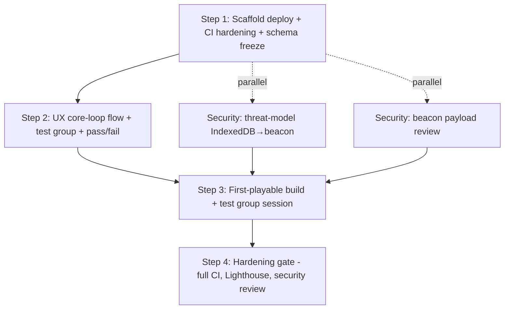

# Prompt — Execute — Execution Spec — XP & Skill Progression Slice (MVP Fantasy: Survivors in Vector Clothing)

**Category:** execution  
**Target Role / Room:** coding agent  
**Version:** 1.0  
**Date:** 2026-09-17  
**Project:** [[Project]]  

## Purpose & Scope

Hand the "Execution Spec — XP & Skill Progression Slice (MVP Fantasy: Survivors in Vector Clothing)" plan to a coding agent for implementation.

## System Prompt / Instructions

~~~~markdown
# Execute: Execution Spec — XP & Skill Progression Slice (MVP Fantasy: Survivors in Vector Clothing)

You are implementing a plan that has already been decided. Your job is to execute it, not to redesign it.

## Context

- Project: Asteroids Survivor
- What it is: Classic Asteroids arcade game, with vampire survivor mechanics
- Repository: `E:\Desarrollos\proyectos\Asteroids`
- This plan came out of a Full directive meeting on "Discuss new features for this increment,". Those decisions are settled.
- Source plan: `Plans/2026-09-16-execution-spec-xp-skill.md`
- Current plan pointer: `E:/Desarrollos/proyectos/Asteroids/docs/Plans/2026-09-16-execution-spec-xp-skill.md`

## As built

Current repo — extend it. Do not reverse a shipped increment or a frozen lock unless a Locked decision in this plan explicitly says to replace it.

Open plan (not yet shipped): **Plan — Execution Spec — XP & Skill Progression Slice (MVP Fantasy: Survivors in Vector Clothing)** (`Plans/2026-09-16-execution-spec-xp-skill.md`)

Code snapshot:
- Asteroids Survivor: Classic Asteroids arcade game, with vampire survivor mechanics
- Stack: Node.js, TypeScript
- Top directories: docs, src
- Files: 10
- Git: main @ "Merge pull request #1 from xJokerrr121/claude/wonderful-planck-eglf5x"

Current accepted locks:
- Expert recommendation: Use a typed event emitter (e.g., `mitt` or a minimal custom `EventTarget`) exported from a ded… [[adr-001-registration-invocation]]

Living definitions (one-line; open the file, do not dump it):
- **MVP Fantasy: Survivors in Vector Clothing** [definition] (`Definitions/def-scope-mvp-fantasy-survivors-vector.md`) — The operator chose the 'Survivors in Vector Clothing' fantasy to anchor the MVP on a single, proven retention loop with one control scheme and a concrete session-length target. This avoids the dual-mode compromise and the fundamental tension between reflex-first and build-first designs.

## Goal

Ship the smallest playable XP/skill slice: XP drops on asteroid `shatter()`, fixed level-up thresholds (100, 250, 450…), an in-world picker (built with `phaser3-rex-plugins`) that pauses physics and floats near the ship, and a `currentBuild: Upgrade[]` key persisted in IndexedDB for the current run only. Meta-progression is explicitly excluded. Success is measured by upgrade-pick → next-session-start rate ≥35% Day-1 via the existing beacon.

## Already settled

- Smallest shippable slice = XP drops on `shatter()` + level-up picker (1 of 3 upgrades) + `currentBuild` persistence for current run only; meta-progression explicitly out (owner: Technical Engineering Manager)
- Success metric: upgrade-pick → next-session-start rate ≥35% Day-1 (owner: Data Analyst)
- XP drops on `shatter()` hook: 10–25 XP per large asteroid break; level-up at fixed thresholds (100, 250, 450…); pause physics, show picker, resume (owner: Lead Engineer)
- `currentBuild` key in IndexedDB holds three picks for current run only; wiped on `startRun()` (owner: Lead Engineer)
- UX: in-world picker floating near ship, physics paused, options radiating outward; ≤5s read time, three distinct icons, one-tap/click, no scroll, no tooltip hunt (owner: UX/UI Designer)
- Adopt `phaser3-rex-plugins` for level-up picker scene (owner: Tech Researcher)
- Picker Scene renders to a second camera so world stays visible but dimmed (owner: Technical Engineering Manager)
- `upgrade` event carries world coords (ship-relative) since in-world decided (owner: Lead Engineer)
- `currentBuild` schema is the only new IndexedDB key; must stay fully local with no off-device trust boundary per [[backend-scope-contract]] (owner: Security Engineer)
- `upgrade` event only adds to existing four-field telemetry schema per [[client-side-telemetry-schema]]; no new identifiers (owner: Security Engineer)
- `storage.ts` must persist stable `session_id` across browser close for beacon metric; if not, mint in `startRun()` and write once (owner: Lead Engineer)
- Bundle must stay inside Step 4 budget (owner: Tech Researcher)
- Security Engineer signs off `currentBuild: Upgrade[]` schema (local-only, no new identifiers in telemetry) (owner: Security Engineer)
- Technical Engineering Manager wires picker after security sign-off (owner: Technical Engineering Manager)
- Lead Engineer implements picker scene (half day) and `session_id` persistence (owner: Lead Engineer)
- Ship to Pages for Day-1 retention probe (owner: Technical Engineering Manager)
- Meta-progression explicitly not in this increment (owner: Technical Engineering Manager)

Pinned vault facts (one-line; open the file, do not dump it):
- **MVP Fantasy: Survivors in Vector Clothing** [definition] (`Definitions/def-scope-mvp-fantasy-survivors-vector.md`) — The operator chose the 'Survivors in Vector Clothing' fantasy to anchor the MVP on a single, proven retention loop with one control scheme and a concrete session-length target. This avoids the dual-mode compromise and the fundamental tension between reflex-first and build-first designs.
- **MVP Fantasy: Survivors in Vector Clothing** [definition] (`Definitions/def-scope-mvp-fantasy-survivors-vector.md`) — The operator chose the 'Survivors in Vector Clothing' fantasy to anchor the MVP on a single, proven retention loop with one control scheme and a concrete session-length target. This avoids the dual-mode compromise and the fundamental tension between reflex-first and build-first designs.

## Constraints

- Must: `currentBuild` schema local-only, zero backend, IndexedDB only
- Must: `upgrade` event adds no new identifiers to the four-field telemetry schema (session-start, wave-cleared, upgrade, session-end)
- Must: Picker scene pauses physics (`scene.pause('game')` / `scene.resume('game')`)
- Must: Picker scene renders to second camera with dimmed world
- Must: `upgrade` event carries world coordinates (ship-relative) + `session_id`
- Must: `session_id` persists across browser close in `storage.ts` or is minted once in `startRun()`
- Must: Bundle stays inside Step 4 budget
- Must: Control discovery ≤5 seconds (three icons, one-tap, no scroll, no tooltip hunt)
- Must not: Implement meta-progression (explicitly deferred)
- Must not: Add new telemetry identifiers beyond the four-field schema
- Out of scope: Meta-progression, backend persistence, ad/currency continue mechanics

## Surfaces

Files, modules, endpoints, data shapes, env vars, and commands the room named:
- `storage.ts` — persists `session_id` across browser close; writes `currentBuild: Upgrade[]` to IndexedDB; wiped on `startRun()`
- `shatter()` hook — XP drop point (10–25 XP per large asteroid break)
- `startRun()` — wipes `currentBuild`, mints `session_id` if missing
- `currentBuild: Upgrade[]` — IndexedDB key for current run's three picks
- `phaser3-rex-plugins` — adopted for level-up picker scene
- Picker Scene (Phaser `Scene`) — pauses/resumes `'game'` scene, renders to second camera
- `upgrade` event — fires on pick; payload: `{ worldCoords: {x, y}, session_id, upgradeId, optionsShown: UpgradeOption[], timeToPickMs }`
- Four-event telemetry schema — session-start, wave-cleared, upgrade, session-end (per [[client-side-telemetry-schema]])
- `backend-scope-contract` — zero backend, IndexedDB only
- Step 4 bundle budget — must not exceed

## The plan

```mermaid
flowchart TD
    A[Security signs off currentBuild: Upgrade[] schema] --> B[Data Analyst confirms session_id persistence in storage.ts]
    B --> C[Lead Engineer implements session_id persistence in storage.ts]
    C --> D[Lead Engineer builds in-world picker scene with phaser3-rex-plugins]
    D --> E[TEM wires picker scene into game flow]
    E --> F[UX validates ≤5s control discovery]
    F --> G[Data Analyst verifies upgrade event carries world coords + session_id]
    G --> H[Ship to Pages for Day-1 retention probe]
```

## Atlas

Copied from the living atlas. Do not redraw. Do not treat as new tasks.

### You



## Tasks

1. **security** — Security Engineer reviews and signs off `currentBuild: Upgrade[]` schema as local-only, no off-device trust boundary, no new telemetry identifiers
   - Done when: Security Engineer explicit sign-off recorded; schema shape documented

2. **storage.ts** — Data Analyst confirms whether `storage.ts` already persists stable `session_id` across browser close; if not, Lead Engineer adds mint-in-`startRun()` fallback (write once)
   - Done when: `storage.ts` read/write test shows `session_id` survives browser close/reopen

3. **storage.ts** — Lead Engineer implements `session_id` persistence (mint UUID in `startRun()` if absent, write once) and `currentBuild: Upgrade[]` CRUD (write on pick, wipe on `startRun()`)
   - Done when: Unit tests verify `session_id` stable across sessions; `currentBuild` wiped on `startRun()`; IndexedDB only

4. **src/scenes/LevelUpPickerScene.ts` (new)** — Lead Engineer builds in-world picker scene using `phaser3-rex-plugins`: pauses `'game'` scene, renders to second camera with dimmed world, floats near ship, three icons radiating outward, one-tap/click, no scroll
   - Done when: Scene loads, pauses physics, shows three distinct upgrade options (damage, fire rate, max speed, magnet radius — pick 3), resumes on pick; bundle size within Step 4 budget

5. **src/scenes/GameScene.ts` (or equivalent)** — TEM wires picker into game flow: on level-up threshold (100, 250, 450…), launch `LevelUpPickerScene`, pass ship world coords, handle `upgrade-pick` event
   - Done when: Level-up triggers at correct XP thresholds; picker appears at ship-relative world coords; physics pauses/resumes cleanly

6. **ux-validation** — UX validates control discovery ≤5 seconds on mobile and desktop: three icons readable, one-tap/click, no tooltip hunt
   - Done when: UX sign-off recorded; any required vignette/enlarge-on-hover implemented

7. **telemetry** — Data Analyst verifies `upgrade` event fires on pick with payload `{ worldCoords, session_id, upgradeId, optionsShown, timeToPickMs }` and no new identifiers added to four-field schema
   - Done when: Beacon capture shows correct payload; schema validation passes

8. **deploy** — Ship to Pages for Day-1 retention probe
   - Done when: Live on Pages; upgrade-pick → next-session-start metric instrumented and queryable

## Definition of done

- `currentBuild: Upgrade[]` schema signed off by Security Engineer (local-only, no new telemetry IDs)
- `session_id` persists across browser close in `storage.ts` (or minted once in `startRun()`)
- XP drops 10–25 on `shatter()`; level-up triggers at 100, 250, 450… XP
- Picker scene: in-world, second camera, dimmed world, physics paused, three icons, one-tap, ≤5s discovery
- `upgrade` event carries world coords (ship-relative) + `session_id`; no new telemetry identifiers
- Bundle size within Step 4 budget
- Day-1 retention probe live on Pages; upgrade-pick → next-session-start rate measurable

- Every "Done when" above holds.
- The project's tests pass, or you have said exactly which ones do not and why.
- The diff contains nothing outside these tasks.
- The plan note `Plans/2026-09-16-execution-spec-xp-skill.md` is marked finished: set `status: completed` in its YAML frontmatter and change its `**Status:**` line to `Completed`. Do this only once every task above is genuinely done — it is what tells the project the plan is closed.

## Open risks

- Exact `Upgrade` type shape (fields, option pool) not fully specified in transcript — Security sign-off depends on this
- `storage.ts` current implementation unknown — may need survey before Step 2/3
- `phaser3-rex-plugins` version compatibility with current Phaser version not confirmed
- Step 4 bundle budget numeric limit not stated in room
- `startRun()` location and signature not named — area label: `game-flow`
- `shatter()` hook location not named — area label: `asteroid-system`
- Four-field telemetry schema exact field names not named — ref: [[client-side-telemetry-schema]]
- `backend-scope-contract` exact wording not named — ref: [[backend-scope-contract]]
- Date for Day-1 retention probe not set — put under Open risks
- Whether `UpgradeOption[]` includes all four upgrade types (damage, fire rate, max speed, magnet radius) or a subset per level not specified

Do not fill these in. Stop and say so if they block a task.

## Ground rules

- Work through the tasks in order — they are sequenced by dependency.
- Stay inside the scope of these tasks. Anything you notice but was not asked for goes in your final report, not into the diff.
- Match the conventions of the code already around you rather than importing your own.
- Run the project's tests (or the closest equivalent) before you call a task done, and say what you ran.
- Do not delete or overwrite files that are not part of a task, and confirm before any irreversible action.

## If the plan is wrong

If a task turns out to be impossible, already done, or contradicted by the as-built code or a locked decision, stop at that task and say so,
with what you found. Do not substitute your own design. Do not reverse a shipped increment or a frozen schema unless a Locked decision in this plan explicitly says to replace it.

## Reference material

Background the council relied on. Read what you need; do not treat it as more tasks.

- **MVP Fantasy: Survivors in Vector Clothing** [definition] (`Definitions/def-scope-mvp-fantasy-survivors-vector.md`) — The operator chose the 'Survivors in Vector Clothing' fantasy to anchor the MVP on a single, proven retention loop with one control scheme and a concrete session-length target. This avoids the dual-mode compromise and the fundamental tension between reflex-first and build-first designs.
- **Code — src/telemetry** [code] (`Code/src-telemetry.md`) — This area implements the client-side telemetry beacon used by the game. It sends a closed set of three event types (`session_start`, `death`, `continue_click`) to an allowlisted analytics endpoint using `navigator.sendBeacon()`. The transpo
~~~~

## Expected Output Format

The 8 tasks implemented in order, each meeting its acceptance criterion.

---

## Links

- [[Project]]
