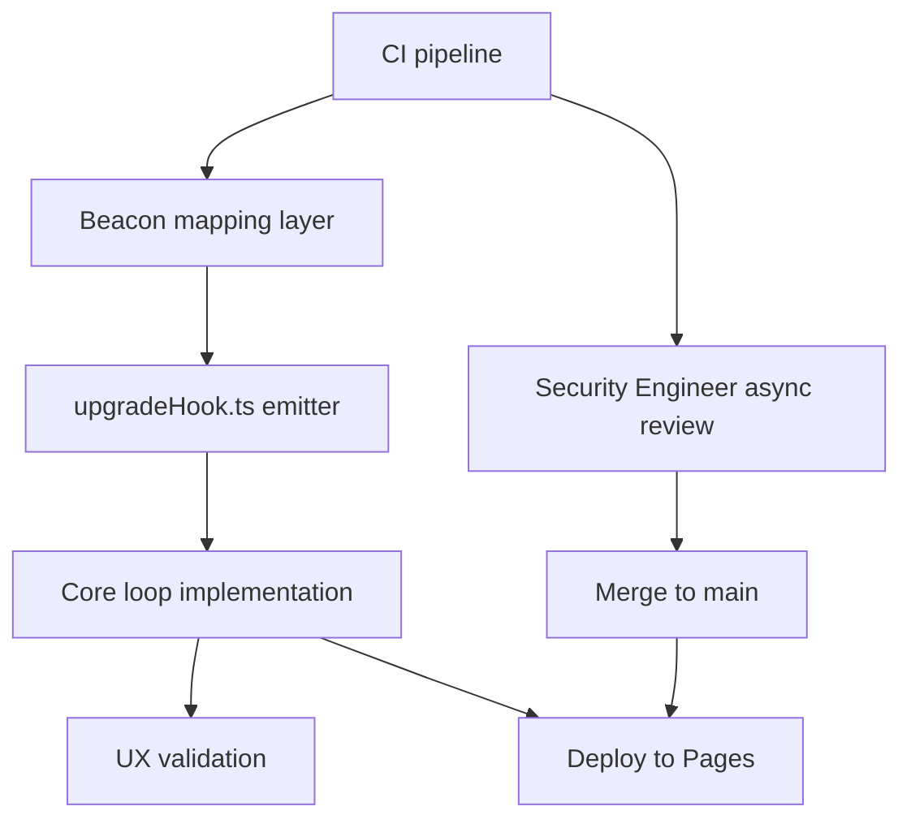

# Prompt — Execute — lets deliver the next increment

**Category:** execution  
**Target Role / Room:** coding agent  
**Version:** 1.0  
**Date:** 2026-09-15  
**Project:** [[Project]]  

## Purpose & Scope

Hand the "lets deliver the next increment" plan to a coding agent for implementation.

## System Prompt / Instructions

~~~~markdown
# Execute: lets deliver the next increment

You are implementing a plan that has already been decided. Your job is to execute it, not to redesign it.

## Context

- Project: Asteroids Survivor
- What it is: Classic Asteroids arcade game, with vampire survivor mechanics
- Repository: `E:\Desarrollos\proyectos\Asteroids`
- This plan came out of a Full directive meeting on "lets deliver the next increment". Those decisions are settled.
- Source plan: `Plans/2026-09-15-lets-deliver-next-increment.md`
- Current plan pointer: `E:/Desarrollos/proyectos/Asteroids/docs/Plans/2026-09-15-lets-deliver-next-increment.md`

## Goal

Ship the wave-1 core loop (move, auto-fire, XP, upgrade choice, wave clear) as a minimal retention probe to GitHub Pages by 2026-09-16, with four locked telemetry events (session_start, wave_cleared, upgrade_chosen, session_end with duration) feeding Day-1 ≥35% / Day-7 ≥12% retention targets. CI must land first to unblock merge; beacon mapping must wire the upgrade_chosen hook before core loop can complete; UX validation (5-second control discovery, single-choice upgrade clarity, juicy wave-clear feedback) runs against the landed core loop.

## Already settled

- Gate three = wave-1 core loop shipped to Pages by tomorrow (owner: Technical Engineering Manager)
- Four telemetry events locked: session_start, wave_cleared, upgrade_chosen, session_end (with duration) (owner: Data Analyst)
- Retention success criteria: ≥35% Day-1, ≥12% Day-7 (owner: Data Analyst)
- Three workstreams ordered: CI first, beacon events second, core loop third (owner: Lead Engineer)
- Persistence layer stays pure — generic store-change hook only; telemetry module maps to beacon events (owner: Architect)
- upgrade_chosen hook mechanism: typed event emitter (mitt or minimal EventTarget) from dedicated `upgradeHook.ts` module (owner: Technical Engineering Manager, Data Analyst)
- Workstream ownership: Lead Engineer → CI; TEM → beacon mapping + core loop (mapping first); Security Engineer → async merge gate (owner: Product Manager)
- No next-increment planning until current increment ships and retention data reviewed (owner: Architect, Data Analyst, Lead Engineer, UX/UI Designer, Tech Researcher)

Pinned vault facts (one-line; open the file, do not dump it):
- **lets deliver the next increment** [meeting] (`Meetings/2026-09-15-lets-deliver-next-increment.md`) — Meeting note on lets deliver the next increment.
- **Minutes — lets deliver the next increment** [minutes] (`Minutes/2026-09-15-lets-deliver-next-increment-minutes.md`) — Minutes for lets deliver the next increment.
- **lets deliver the next increment** [meeting] (`Meetings/2026-09-15-lets-deliver-next-increment.md`) — Meeting note on lets deliver the next increment.
- **Minutes — lets deliver the next increment** [minutes] (`Minutes/2026-09-15-lets-deliver-next-increment-minutes.md`) — Minutes for lets deliver the next increment.

## Constraints

- Must ship to GitHub Pages by 2026-09-16
- CI pipeline: `npm ci && npm run build && npx gh-pages -d deploys` on every `main` push; no lint/typecheck/test gates
- Beacon payload must include exactly the four events with schema: session_id, event_name, timestamp, properties
- Persistence layer fires only a generic store-change hook; no UI logic in persistence
- Upgrade choice presentation: one clear choice, text + icon, single tap/click, no hover-only affordances
- Wave clear feedback: visible juicy moment surfacing upgrade, must not feel like pause screen
- Workbox queue is stretch; ship without it if day ends tight
- Security Engineer review blocks merge only, not start
- UX validation for Gate 3 tied to core loop landing tomorrow

## Surfaces

- CI pipeline: `npm ci && npm run build && npx gh-pages -d dist`
- `upgradeHook.ts` — typed event emitter module exporting `emitter.on('upgrade_chosen', handler)` and `emitter.emit('upgrade_chosen', upgradeId)`
- Persistence layer — generic store-change hook (already exists)
- Telemetry module — maps persistence hook to four beacon events (new wiring)
- Beacon transport — `navigator.sendBeacon()` to managed analytics endpoint
- Core loop — move, auto-fire, XP, upgrade choice, wave clear
- GitHub Pages deployment target: `dist/` folder

## The plan

## Tasks

1. **ci/pipeline** — Implement CI job: `npm ci && npm run build && npx gh-pages -d dist` on every `main` push; no lint/typecheck/test gates
   - Done when: GitHub Actions workflow runs green on push to main and publishes `dist/` to gh-pages branch

2. **telemetry/upgradeHook.ts** — Create typed event emitter module (mitt or minimal EventTarget) exporting `on('upgrade_chosen', handler)` and `emit('upgrade_chosen', upgradeId)`
   - Done when: Module imports cleanly; unit test verifies emit/subscribe round-trip with typed payload

3. **telemetry/beaconMapping.ts** — Build mapping layer: subscribe to persistence generic store-change hook, translate to four beacon events (session_start, wave_cleared, upgrade_chosen, session_end with duration), send via `navigator.sendBeacon()`
   - Done when: Each of four events fires with correct schema (session_id, event_name, timestamp, properties) in browser devtools network tab

4. **core/loop.ts** — Implement wave-1 core loop: player move, auto-fire, XP accumulation, upgrade choice presentation (single choice, text+icon, single tap/click), wave clear detection
   - Done when: Local playtest shows move/auto-fire/XP working; upgrade choice appears once per wave clear; choice emits via `upgradeHook.ts` emitter

5. **core/waveClearFeedback.ts** — Implement juicy wave-clear moment that surfaces upgrade without pause-screen feel
   - Done when: Visual/audio feedback triggers on wave clear; upgrade choice appears within same flow; no modal that stops run momentum

6. **ux/validation** — Validate Gate 3 UX criteria: 5-second control discovery, upgrade choice clarity (single choice, text+icon, tap/click), wave-clear feedback preserves momentum
   - Done when: UX/UI Designer signs off on recorded playthrough meeting all three criteria

## Definition of done

- CI workflow passes on `main` push and deploys to GitHub Pages (verify Pages URL loads)
- Four beacon events visible in analytics endpoint with correct payload schema
- Core loop playable end-to-end: move → auto-fire → XP → wave clear → upgrade choice → next wave
- UX validation criteria met per UX/UI Designer sign-off
- Security Engineer async review completes (merge gate only)
- Deployed Pages URL accessible and functional

- Every "Done when" above holds.
- The project's tests pass, or you have said exactly which ones do not and why.
- The diff contains nothing outside these tasks.
- The plan note `Plans/2026-09-15-lets-deliver-next-increment.md` is marked finished: set `status: completed` in its YAML frontmatter and change its `**Status:**` line to `Completed`. Do this only once every task above is genuinely done — it is what tells the project the plan is closed.

## Open risks

- Exact analytics endpoint URL for `navigator.sendBeacon()` not named in room — confirm with Data Analyst
- `mitt` vs minimal `EventTarget` choice for `upgradeHook.ts` not finalized — TEM to decide
- Workbox queue implementation details not specified — stretch item, may be dropped
- Security Engineer review timeline unknown — async, blocks merge only
- Day-1/7 retention targets are success criteria but cannot be verified until post-launch measurement

Do not fill these in. Stop and say so if they block a task.

## Ground rules

- Work through the tasks in order — they are sequenced by dependency.
- Stay inside the scope of these tasks. Anything you notice but was not asked for goes in your final report, not into the diff.
- Match the conventions of the code already around you rather than importing your own.
- Run the project's tests (or the closest equivalent) before you call a task done, and say what you ran.
- Do not delete or overwrite files that are not part of a task, and confirm before any irreversible action.

## If the plan is wrong

If a task turns out to be impossible, already done, or contradicted by the code, stop at that task and say so,
with what you found. Do not substitute your own design for the one that was agreed.

## Reference material

Background the council relied on. Read what you need; do not treat it as more tasks.

- **ADR 001: Registration and invocation mechanism for the upgrade_chosen hook** [adr] (`ADRs/adr-001-registration-invocation.md`) — Expert recommendation: Use a typed event emitter (e.g., `mitt` or a minimal custom `EventTarget`) exported from a dedicated `upgradeHook.ts` module; the core loop calls `emitter.emit('upgrade_chosen', upgradeId)` and the UX validator subscribes via `emitter.on('upgrade_chosen', handler)`.
- **CI pipeline definition** [definition] (`Definitions/ci-pipeline-definition.md`) — Cheap budget: Single job: `npm ci && npm run build && npx gh-pages -d dist`; no lint/typecheck/test gates, deploy on every `main` push.
- **Minutes — lets deliver the next increment** [minutes] (`Minutes/2026-09-15-lets-deliver-next-increment-minutes.md`) — Minutes for lets deliver the next increment.
- **Roadmap — lets deliver the next increment** [roadmap] (`Roadmaps/9e074528-roadmap.md`) — Strategic implementation roadmap for lets deliver the next increment.
- **lets deliver the next increment** [meeting] (`Meetings/2026-09-15-lets-deliver-next-increment.md`) — Meeting note on lets deliver the next increment.
~~~~

## Expected Output Format

The 6 tasks implemented in order, each meeting its acceptance criterion.

---

## Links

- [[Project]]
- [[Index]]
