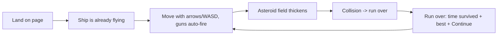

# Core loop flow — MVP increment

**Owner:** UX/UI Designer
**Due:** 2026-09-12 09:00
**Plan:** [[2026-09-11-execution-spec-plan-first]]

## 1. First-run experience

The page loads straight into a live run — no title screen, no menu, no
tutorial. The ship is already drifting in the centre of the field and the guns
are already firing at the nearest rock.

One line of copy sits under the play field: *"Move with the arrow keys or WASD.
Your guns fire themselves."* That is the whole onboarding. It names the controls
in the player's own vocabulary (arrow keys, WASD) rather than inventing terms.

A run timer counts up at the top of the field, so "how long did I last" is
legible while playing, not just after dying.

## 2. What persists (IndexedDB keys)

Database `asteroids-survivor`, object store `game-state`, one record under the
key `run-state`:

| Field | Type | Written | Meaning |
| --- | --- | --- | --- |
| `highScoreMs` | number | on death | Best survival time on this device |
| `lastRunAt` | string | on death | ISO 8601 timestamp of the last run that ended |
| `runCount` | number | on death | Total runs finished on this device |

Nothing else is stored. No name, no email, no account, no free text. The record
is device-local: clearing site data clears it, and there is no recovery — the
player is told this only if they ask, because the MVP never asks them for
anything to lose.

## 3. Return-visit flow

A returning player gets exactly the same entry as a first-time player: the page
opens into a live run. The difference is only visible after they die — the
"Run over" panel shows `Best: <time> · Runs: <n>` read back from IndexedDB, so
the previous session is acknowledged at the moment it matters.

`session_start` carries `returning: true` when a stored record exists, so the
return rate is measurable against the retention targets (Day-1 ≥ 35%,
Day-7 ≥ 12%) without storing anything that identifies a person.

## 4. Test group and pass/fail criteria

**Test group:** 3 weekly browser-arcade players — 1 streamer, 1 speedrunner,
1 casual. Recruited by **2026-09-18**. Recorded in `docs/ux/test-group.md`.

**Session:** **2026-09-21 10:00**, observed, one facilitator. Each tester plays
the first-playable build cold — no briefing beyond "here is the link".

**Pass/fail criteria:** survive 90s on first life AND hit "continue" after death
without asking what to do.

**Gate:** ≥2 of 3 testers pass to proceed. Results recorded in
`docs/ux/session-2026-09-21.md`.
